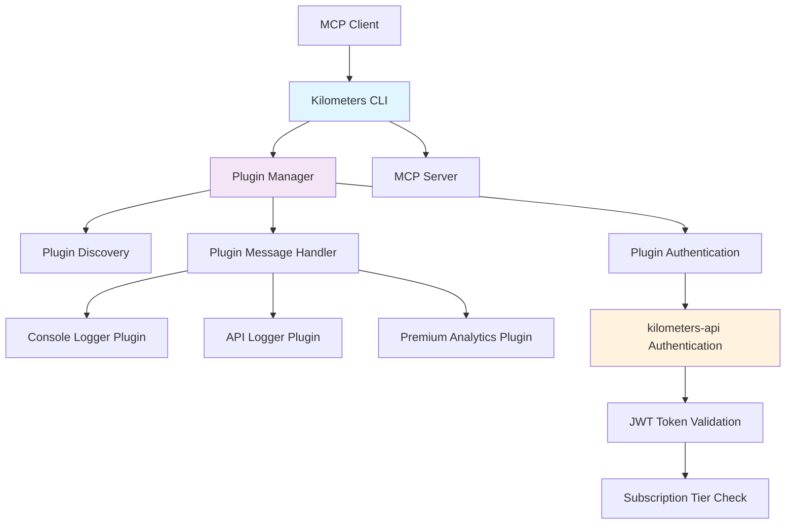
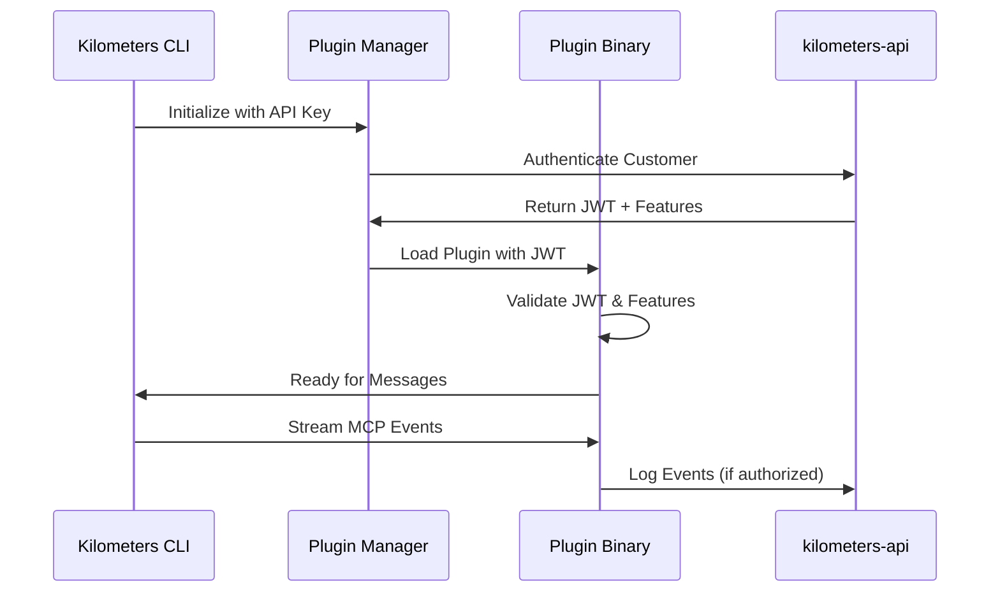

# 🚀 **Kilometers CLI** - Enterprise MCP Monitoring with Secure Plugins

[](https://github.com/kilometers-ai/kilometers-cli/actions)
[](https://opensource.org/licenses/MIT)
[](https://golang.org/doc/install)

A **transparent proxy** and **secure monitoring platform** for Model Context Protocol (MCP) servers with enterprise-grade plugin architecture and tier-based premium features.

## 🎯 **What is Kilometers CLI?**

Kilometers CLI (`km`) is a **stateless, event-driven monitoring tool** that sits transparently between MCP clients and servers, capturing and analyzing JSON-RPC communication with zero disruption to your workflow.

### **🔑 Key Features**

- **🔍 Transparent Proxy**: Zero-disruption MCP message interception
- **🔌 Secure Plugin Architecture**: Enterprise-grade go-plugins with customer-specific binaries
- **🏢 Tier-Based Premium Features**: Free, Pro, and Enterprise subscription tiers
- **🔒 Multi-Layer Security**: Binary signing, API authentication, and customer isolation
- **⚡ Real-Time Monitoring**: Live stream analysis with 5-minute local caching
- **📊 Comprehensive Analytics**: Full JSON-RPC message analysis and debugging
- **🌐 Cross-Platform**: Windows, macOS, and Linux support

---

## 🏗️ **Architecture Overview**

### **Plugin-Based Security Model**



### **Security Architecture**

- **🔐 Customer-Specific Binaries**: Each plugin is built uniquely per customer
- **📝 Digital Signatures**: Binary integrity validation with tamper detection
- **🎫 JWT Authentication**: Plugin-specific tokens with embedded feature access
- **⏰ Real-Time Validation**: 5-minute cached subscription status checks
- **🚫 Graceful Degradation**: Silent failures for unauthorized access attempts

---

## 📂 **Project Structure**

```
kilometers-cli/
├── cmd/                    # Application entry points
├── internal/               # Core application logic
├── examples/               # Plugin examples and demos
├── scripts/                # Development and deployment scripts
├── docs/                   # Developer documentation
└── memory-bank/            # Project memory and context
```

---

## 🚀 **Quick Start**

### **Installation**

```bash
# Install via script (recommended)
curl -fsSL https://install.kilometers.ai | sh

# Or install via Go
go install github.com/kilometers-ai/kilometers-cli/cmd@latest

# Or download from releases
# https://github.com/kilometers-ai/kilometers-cli/releases
```

### **Configuration**

```bash
# Initialize with automatic configuration discovery (NEW!)
km init --auto-detect

# Auto-detect with plugin provisioning
km init --auto-detect --auto-provision-plugins

# Manual initialization
km init --api-key YOUR_API_KEY --endpoint https://api.kilometers.ai

# Initialize with plugin auto-provisioning
km init --auto-provision-plugins
```

The `--auto-detect` flag automatically discovers configuration from:
- Environment variables (`KILOMETERS_*`, `KM_*`)
- Configuration files (`.env`, `config.yaml`, `config.json`)
- Docker Compose files
- Running containers
- Secure credential stores

### **Basic Usage**

```bash
# Monitor an MCP server (console logging only)
km monitor -- your-mcp-server --args

# With API key for premium features
export KM_API_KEY="your-api-key"
km monitor -- your-mcp-server --args

# Custom configuration
km monitor --config /path/to/config.json -- your-mcp-server
```

### **Example: Monitoring Claude Desktop MCP**

```bash
# Monitor Claude Desktop with MCP server
km monitor -- npx -y @modelcontextprotocol/server-filesystem /path/to/directory

# With real-time API analytics (Pro/Enterprise)
export KM_API_KEY="km_live_your_api_key"
km monitor --endpoint https://api.kilometers.ai -- npx -y @modelcontextprotocol/server-filesystem /path/to/directory
```

---

## 🔌 **Plugin Architecture**

### **Available Plugins**

| Plugin | Tier | Description |
|--------|------|-------------|
| **Console Logger** | Free | Silent local console output |
| **API Logger** | Pro+ | Real-time API analytics and storage |
| **Premium Analytics** | Enterprise | Advanced monitoring and insights |

### **Plugin Security Model**



### **Plugin Development**

See **[Plugin Development Guide](docs/plugins/DEVELOPMENT.md)** for:
- Creating new plugins
- Security implementation
- Testing and validation
- Distribution process

---

## 🛠️ **Development Scripts**

Scripts are organized by purpose in the `scripts/` directory:

- **Build**: Multi-platform release builds
- **Test**: Comprehensive testing and validation  
- **Install**: Cross-platform installation
- **Plugin**: Plugin development and security tools

See individual script files for usage details.

---

## 📖 **Documentation**

### **Available Documentation**

- **[Getting Started](docs/development/GETTING_STARTED.md)** - Development setup
- **[Build, Run & Test Guide](docs/development/BUILD_RUN_TEST.md)** - Comprehensive commands reference
- **[Architecture](docs/development/ARCHITECTURE.md)** - System design  
- **[Script Reference](docs/development/SCRIPT_REFERENCE.md)** - Script usage
- **[Plugin Development](docs/plugins/DEVELOPMENT.md)** - Plugin creation guide
- **[Plugin Authentication](docs/plugins/PLUGIN_AUTHENTICATION.md)** - Security & authentication details

---

## 🔒 **Security & Premium Features**

### **Subscription Tiers**

| Feature | Free | Pro | Enterprise |
|---------|------|-----|------------|
| Console Logging | ✅ | ✅ | ✅ |
| API Analytics | ❌ | ✅ | ✅ |
| Real-time Monitoring | ❌ | ✅ | ✅ |
| Advanced Analytics | ❌ | ❌ | ✅ |
| Custom Plugins | ❌ | ❌ | ✅ |
| Priority Support | ❌ | ❌ | ✅ |

### **Security Features**

- **🔐 Customer-Specific Binaries**: Plugins built uniquely per customer
- **📝 Digital Signatures**: Tamper-resistant binary validation
- **🎫 JWT Authentication**: Secure plugin-specific tokens
- **⏰ Real-Time Validation**: Live subscription status checking
- **🔒 API Key Security**: Secure authentication with kilometers-api

---

## 🤝 **Contributing**

We welcome contributions! Please see our **[Contributing Guide](docs/development/CONTRIBUTING.md)** for:

- 🐛 **Bug Reports**: How to report issues
- 💡 **Feature Requests**: Suggesting new features
- 🔧 **Development**: Setting up development environment
- 📋 **Pull Requests**: Contribution workflow
- 🧪 **Testing**: Running and writing tests

### **Development Setup**

```bash
# Clone repository
git clone https://github.com/kilometers-ai/kilometers-cli.git
cd kilometers-cli

# Install dependencies
go mod download

# Run tests
./scripts/test/run-tests.sh

# Build
go build -o km ./cmd/main.go
```

> 📖 **See the [Build, Run & Test Guide](docs/development/BUILD_RUN_TEST.md) for detailed commands and options**

---

## 📊 **Monitoring & Analytics**

### **Real-Time Monitoring** (Pro+)

- **📈 Live Metrics**: Real-time MCP message analytics
- **🔍 Request Tracing**: Full JSON-RPC message inspection
- **⚡ Performance**: Sub-millisecond proxy overhead
- **📊 Dashboards**: Web-based monitoring interface

### **Enterprise Analytics** (Enterprise)

- **📈 Advanced Metrics**: Custom analytics and reporting
- **🔒 Compliance**: SOC2 and enterprise security
- **🏢 Multi-Tenant**: Organization-wide monitoring
- **🎯 Custom Plugins**: Tailored monitoring solutions

---

## 📞 **Support**

- **📖 Documentation**: [docs.kilometers.ai](https://docs.kilometers.ai)
- **💬 Community**: [github.com/kilometers-ai/kilometers-cli/discussions](https://github.com/kilometers-ai/kilometers-cli/discussions)
- **🐛 Issues**: [github.com/kilometers-ai/kilometers-cli/issues](https://github.com/kilometers-ai/kilometers-cli/issues)
- **✉️ Enterprise**: [enterprise@kilometers.ai](mailto:enterprise@kilometers.ai)

---

## 📜 **License**

This project is licensed under the MIT License - see the [LICENSE](LICENSE) file for details.

---

## 🙏 **Acknowledgments**

- **Anthropic** for the Model Context Protocol specification
- **HashiCorp** for the go-plugin architecture inspiration
- **The Go Community** for excellent tooling and libraries

---

**Built with ❤️ by the Kilometers.ai team**