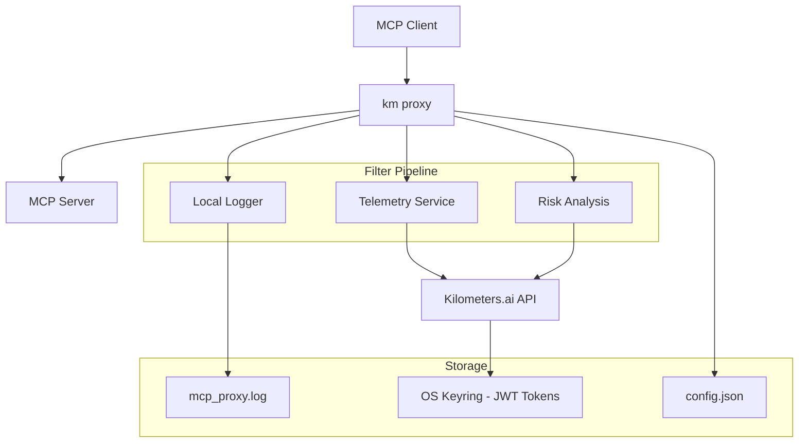

<div align="center">

# 🛰️ Kilometers CLI (`km`)

**The intelligent MCP proxy for modern AI workflows**

[](https://github.com/kilometers-ai/kilometers-cli/actions/workflows/ci.yml)
[](https://github.com/kilometers-ai/kilometers-cli/releases)
[](https://opensource.org/licenses/MIT)
[](https://www.rust-lang.org/)
[](https://github.com/kilometers-ai/kilometers-cli/releases)
[](https://discord.gg/kilometers)

*A high-performance Rust-based MCP (Model Context Protocol) proxy that intelligently monitors, logs, and enhances AI model interactions while providing comprehensive telemetry and risk analysis.*

[🚀 Quick Start](#-quick-start) • [📖 Documentation](https://kilometers.ai/docs) • [💬 Community](https://discord.gg/kilometers) • [🐛 Report Bug](https://github.com/kilometers-ai/kilometers-cli/issues) • [✨ Request Feature](https://github.com/kilometers-ai/kilometers-cli/issues/new?template=feature_request.md)

</div>

---

## 📑 Table of Contents

- [🎯 Overview](#-overview)
- [✨ Features](#-features)
- [🚀 Quick Start](#-quick-start)
- [📦 Installation](#-installation)
- [🔧 Configuration](#-configuration)
- [🎮 Usage](#-usage)
- [🏗️ Architecture](#️-architecture)
- [💻 Development](#-development)
- [🚀 Deployment](#-deployment)
- [🔍 Troubleshooting](#-troubleshooting)
- [🗺️ Roadmap](#️-roadmap)
- [🤝 Contributing](#-contributing)
- [🌟 Community](#-community)
- [📄 License](#-license)

---

## 🎯 Overview

Kilometers CLI is a sophisticated Model Context Protocol (MCP) proxy designed for developers and organizations who need intelligent monitoring, logging, and risk analysis of their AI model interactions. Built with Rust for maximum performance and reliability, it seamlessly integrates into existing AI workflows while providing enterprise-grade telemetry and security features.

### 🎪 Why Kilometers CLI?

- **🔍 Complete Visibility**: Monitor every MCP request and response with detailed logging
- **🛡️ Risk Analysis**: Intelligent filtering and risk assessment for enterprise security
- **📊 Rich Telemetry**: Comprehensive analytics and usage tracking via the Kilometers.ai platform
- **⚡ High Performance**: Built in Rust for minimal latency and maximum throughput
- **🔧 Zero Configuration**: Works out-of-the-box with sensible defaults
- **🌐 Universal Compatibility**: Works with any MCP-compliant client and server

### 🎯 Perfect For

- **AI Developers** building applications with Claude Desktop, VS Code extensions, or custom MCP clients
- **DevOps Teams** monitoring AI infrastructure and usage patterns
- **Security Engineers** implementing governance and risk management for AI systems
- **Organizations** requiring audit trails and compliance for AI model usage

---

## ✨ Features

<table>
<tr>
<td width="50%">

### 🔍 **Monitoring & Logging**
- **Real-time MCP Traffic Inspection** - Monitor all JSON-RPC communications
- **Structured Logging** - JSON Lines format for easy parsing and analysis
- **Multi-tier Logging** - Local files + cloud telemetry based on user tier
- **Request/Response Correlation** - Track complete interaction flows
- **Platform-specific Storage** - Respects OS conventions for data directories

</td>
<td width="50%">

### 🛡️ **Security & Risk Analysis**
- **JWT-based Authentication** - Secure API key exchange and token management
- **Tier-based Risk Analysis** - Advanced filtering for paid users
- **Command Transformation** - Automatic risk mitigation suggestions
- **Audit Trail** - Complete history of all commands and responses
- **Configurable Risk Thresholds** - Customizable security policies

</td>
</tr>
<tr>
<td width="50%">

### 📊 **Analytics & Telemetry**
- **Usage Metrics** - Command frequency, response times, error rates
- **User Tier Management** - Free and paid tier feature differentiation
- **Session Tracking** - Comprehensive session analytics with UUIDs
- **Performance Monitoring** - Latency, throughput, and resource usage
- **Custom Metadata** - Extensible event tracking system

</td>
<td width="50%">

### ⚡ **Performance & Reliability**
- **Asynchronous Architecture** - Built on Tokio for high concurrency
- **Non-blocking Operations** - Failures in logging/telemetry don't block proxy
- **Automatic Reconnection** - Resilient handling of network interruptions
- **Resource Efficient** - Minimal memory footprint and CPU usage
- **Cross-platform** - Native binaries for Windows, macOS, and Linux

</td>
</tr>
</table>

---

## 🚀 Quick Start

Get up and running with Kilometers CLI in under 2 minutes:

### 1. Install

```bash
# One-liner installation (recommended)
curl -fsSL https://install.kilometers.ai | sh
```

### 2. Initialize

```bash
# Set up your API key
km init
```

### 3. Start Monitoring

```bash
# Monitor any MCP server (example: filesystem server)
km monitor -- npx -y @modelcontextprotocol/server-filesystem ~/Documents
```

That's it! 🎉 Your MCP traffic is now being monitored, logged, and analyzed.

<details>
<summary><strong>💡 Want to see it in action?</strong></summary>

```bash
# Terminal 1: Start the proxy
km monitor -- npx -y @modelcontextprotocol/server-filesystem ~/Documents

# Terminal 2: Connect with Claude Desktop or any MCP client
# Your requests will be logged and analyzed automatically
```

Check your logs at `~/.local/share/km/mcp_proxy.log` to see the captured traffic!

</details>

---

## 📦 Installation

Choose your preferred installation method:

### 🎯 Recommended: One-liner Script

```bash
# Unix/Linux/macOS
curl -fsSL https://install.kilometers.ai | sh

# Windows (PowerShell)
iwr https://install.kilometers.ai/windows | iex
```

<details>
<summary><strong>🔍 What does the installer do?</strong></summary>

The installation script:
- ✅ Detects your operating system and architecture
- ✅ Downloads the latest release binary
- ✅ Installs to `/usr/local/bin` (Unix) or `Program Files` (Windows)
- ✅ Sets up shell completions
- ✅ Verifies installation with `km --version`

</details>

### 📋 Package Managers

<table>
<tr>
<td><strong>Cargo</strong></td>
<td><code>cargo install km</code></td>
</tr>
<tr>
<td><strong>Homebrew</strong></td>
<td><code>brew install kilometers-ai/tap/km</code></td>
</tr>
<tr>
<td><strong>Scoop (Windows)</strong></td>
<td><code>scoop install km</code></td>
</tr>
<tr>
<td><strong>Arch Linux</strong></td>
<td><code>yay -S km-bin</code></td>
</tr>
</table>

### 🐳 Docker

```bash
# Run directly
docker run --rm -it kilometers/km:latest init

# Use with volume mounts for persistent config
docker run --rm -v ~/.config/km:/root/.config/km kilometers/km:latest monitor -- <your-command>
```

### 📥 Pre-built Binaries

Download platform-specific binaries from our [releases page](https://github.com/kilometers-ai/kilometers-cli/releases):

| Platform | Architecture | Download |
|----------|-------------|----------|
| Linux | x86_64 | [km-linux-x86_64](https://github.com/kilometers-ai/kilometers-cli/releases/latest/download/km-linux-x86_64) |
| Linux | ARM64 | [km-linux-arm64](https://github.com/kilometers-ai/kilometers-cli/releases/latest/download/km-linux-arm64) |
| macOS | x86_64 | [km-macos-x86_64](https://github.com/kilometers-ai/kilometers-cli/releases/latest/download/km-macos-x86_64) |
| macOS | ARM64 (M1/M2) | [km-macos-arm64](https://github.com/kilometers-ai/kilometers-cli/releases/latest/download/km-macos-arm64) |
| Windows | x86_64 | [km-windows-x86_64.exe](https://github.com/kilometers-ai/kilometers-cli/releases/latest/download/km-windows-x86_64.exe) |

### 🔨 From Source

```bash
# Prerequisites: Rust 1.70+, Git
git clone https://github.com/kilometers-ai/kilometers-cli.git
cd kilometers-cli
cargo build --release
cp target/release/km /usr/local/bin/
```

### ✅ Verify Installation

```bash
# Check version and basic functionality
km --version
km --help

# Test with a simple command
km init --help
```

---

## 🔧 Configuration

Kilometers CLI offers flexible configuration options to fit any workflow:

### 🔑 API Key Setup

Get your API key from [kilometers.ai](https://kilometers.ai/dashboard) and configure it:

```bash
# Interactive setup (recommended)
km init

# Or set via environment variable
export KM_API_KEY="km_live_your_api_key_here"
```

**Security Note:** Your API key and authentication tokens are securely stored in your operating system's native credential manager (Keychain on macOS, Credential Manager on Windows, Secret Service on Linux).

### 📋 Configuration Methods

Configuration is loaded in this order of precedence:

1. **🔴 Environment Variables** (highest priority)
2. **🟡 Configuration File**
3. **🟢 Default Values** (lowest priority)

#### Environment Variables

```bash
# Required
export KM_API_KEY="km_live_your_api_key_here"

# Optional
export KM_API_URL="https://api.kilometers.ai"        # API endpoint
export KM_DEFAULT_TIER="enterprise"                  # User tier override
export KM_LOG_LEVEL="info"                          # Logging verbosity
export KM_CONFIG_DIR="$HOME/.config/km"             # Config directory
export KM_DATA_DIR="$HOME/.local/share/km"          # Data directory
```

#### Configuration File

Location: `~/.config/km/config.json` (or `%APPDATA%\km\config.json` on Windows)

**Note:** The configuration file stores settings only. API keys and authentication tokens are stored securely in your OS keyring.

```json
{
  "api_url": "https://api.kilometers.ai",
  "default_tier": "enterprise",
  "log_level": "info",
  "telemetry": {
    "enabled": true,
    "batch_size": 100,
    "flush_interval": 30
  },
  "risk_analysis": {
    "enabled": true,
    "threshold": 0.8,
    "block_high_risk": true
  },
  "proxy": {
    "timeout": 30,
    "max_retries": 3,
    "buffer_size": 8192
  }
}
```

#### .env File Support

For local development, create a `.env` file in your project root:

```bash
# Copy the example
cp .env.example .env

# Edit with your values
KM_API_KEY=km_live_your_api_key_here
KM_API_URL=https://api.kilometers.ai
KM_DEFAULT_TIER=enterprise
```

### 📍 File Locations

| OS | Config Directory | Data Directory | Credential Storage |
|---|---|---|---|
| **Linux** | `~/.config/km/` | `~/.local/share/km/` | Secret Service (D-Bus) |
| **macOS** | `~/.config/km/` | `~/.local/share/km/` | Keychain |
| **Windows** | `%APPDATA%\km\` | `%APPDATA%\km\` | Credential Manager |

### 🎚️ User Tiers

Kilometers CLI adapts its behavior based on your subscription tier:

| Feature | Free Tier | Paid Tier |
|---------|-----------|-----------|
| Local Logging | ✅ | ✅ |
| Telemetry | ❌ | ✅ |
| Risk Analysis | ❌ | ✅ |
| Command Transformation | ❌ | ✅ |
| Priority Support | ❌ | ✅ |

---

## 🎮 Usage

### 🎯 Core Commands

#### `km init` - Initialize Configuration

Set up or update your Kilometers.ai API key:

```bash
# Interactive setup
km init

# Non-interactive with validation
km init --api-key "km_live_your_key" --validate

# Update existing configuration
km init --update
```

#### `km monitor` - Start Proxy Monitoring

The heart of Kilometers CLI - monitor and proxy MCP traffic:

```bash
# Basic usage
km monitor -- <command> [args...]

# Examples
km monitor -- npx -y @modelcontextprotocol/server-filesystem ~/Documents
km monitor -- python mcp-server.py --port 8080
km monitor -- ./my-custom-mcp-server --config server.json
```

**Advanced Options:**

```bash
# Enable verbose logging
km monitor --verbose -- <command>

# Custom session ID for tracking
km monitor --session-id "my-session-123" -- <command>

# Override API settings
km monitor --api-url "https://dev-api.kilometers.ai" -- <command>
```

#### `km clear-logs` - Log Management

Clean up local log files:

```bash
# Clear all logs
km clear-logs

# Clear logs older than 7 days
km clear-logs --older-than 7d

# Interactive confirmation
km clear-logs --interactive
```

### 🌟 Real-world Examples

#### Example 1: Claude Desktop Integration

```bash
# Monitor Claude Desktop's MCP server connections
km monitor -- npx -y @modelcontextprotocol/server-filesystem ~/Projects
```

#### Example 2: Development Workflow

```bash
# Monitor your custom MCP server during development
km monitor --verbose -- python my_mcp_server.py --debug

# In another terminal, check the logs
tail -f ~/.local/share/km/mcp_proxy.log | jq '.'
```

#### Example 3: CI/CD Pipeline

```bash
# Set up environment
export KM_API_KEY="$KILOMETERS_API_KEY"

# Run tests with monitoring
km monitor -- pytest tests/ --mcp-endpoint localhost:8080
```

#### Example 4: Multi-server Proxy Chain

```bash
# Terminal 1: Start first proxy
km monitor --session-id "proxy-1" -- server-a.py --port 8001

# Terminal 2: Start second proxy (chained)
km monitor --session-id "proxy-2" -- server-b.py --upstream localhost:8001
```

### 📊 Monitoring Output

When you run `km monitor`, you'll see:

```bash
🛰️  Kilometers CLI v0.2.0
📡 Initializing proxy...
🔑 Authenticating with Kilometers.ai...
✅ Authentication successful (tier: enterprise)
🚀 Starting MCP server: npx -y @modelcontextprotocol/server-filesystem ~/Documents
📝 Logging to: ~/.local/share/km/mcp_proxy.log
🔍 Session ID: 550e8400-e29b-41d4-a716-446655440000

Proxy is running. Press Ctrl+C to stop.

📈 Statistics:
  Requests: 42    Responses: 41    Errors: 1
  Avg Latency: 23ms    Data: 1.2MB transferred

[14:30:15] DEBUG Request: {"jsonrpc":"2.0","method":"initialize","id":1}
[14:30:15] DEBUG Response: {"jsonrpc":"2.0","result":{"capabilities":{...}},"id":1}
```

---

## 🏗️ Architecture

Kilometers CLI is built with a modular, layered architecture optimized for performance and maintainability:



### 🏛️ Layer Architecture

```
┌─────────────────────────────────────────────┐
│                    CLI                      │  ← clap-based command interface
├─────────────────────────────────────────────┤
│                Application                  │  ← Commands, Services, Business Logic
├─────────────────────────────────────────────┤
│                  Domain                     │  ← Core Types, Auth, Proxy Models
├─────────────────────────────────────────────┤
│               Infrastructure                │  ← HTTP, File I/O, External APIs
└─────────────────────────────────────────────┘
```

### 🔄 Request Flow

1. **MCP Client** sends JSON-RPC request via stdin
2. **km proxy** receives and parses the request
3. **Filter Pipeline** processes the request:
   - **Local Logger** writes to `mcp_proxy.log`
   - **Telemetry Filter** sends usage data (paid users only)
   - **Risk Analysis Filter** evaluates and potentially blocks/transforms (paid users only)
4. **Process Manager** forwards request to target MCP server
5. **MCP Server** processes and responds
6. **Filter Pipeline** processes the response (logging, telemetry)
7. **km proxy** forwards response back to client via stdout

### 🗂️ Project Structure

```
kilometers-cli/
├── 📁 src/
│   ├── 📄 main.rs                 # CLI entry point & argument parsing
│   ├── 📄 lib.rs                  # Library exports
│   ├── 📄 cli.rs                  # Command-line interface structures
│   ├── 📄 config.rs               # Configuration management
│   ├── 📄 proxy.rs                # Core proxy logic
│   ├── 📄 auth.rs                 # JWT authentication & API key exchange
│   ├── 📄 token_cache.rs          # JWT token caching & expiration
│   └── 📁 filters/               # Filter pipeline system
│       ├── 📄 mod.rs             # Filter trait & pipeline
│       ├── 📄 local_logger.rs    # Local file logging
│       ├── 📄 event_sender.rs    # Telemetry to API
│       └── 📄 risk_analysis.rs   # Risk assessment & filtering
├── 📁 tests/                      # Integration & unit tests
├── 📁 scripts/                    # Installation & build scripts
│   ├── 📄 install.sh             # Unix installation
│   ├── 📄 install.ps1            # Windows installation
│   ├── 📄 version.sh             # Version management
│   └── 📁 test/                  # Test automation scripts
└── 📁 .github/                   # CI/CD & GitHub templates
    └── 📁 workflows/
        └── 📄 ci.yml             # Automated testing & releases
```

### 🔌 Filter System

The filter system is the heart of Kilometers CLI's extensibility:

```rust
pub trait ProxyFilter: Send + Sync {
    async fn filter(&self, request: &JsonRpcRequest) -> FilterResult;
}

pub enum FilterResult {
    Allow(Option<JsonRpcRequest>),  // Pass through (optionally transformed)
    Block(String),                  // Block with reason
}
```

**Built-in Filters:**

- **LocalLoggerFilter**: Always active, logs all traffic locally
- **EventSenderFilter**: Sends telemetry (paid users only)
- **RiskAnalysisFilter**: Risk assessment and blocking (paid users only)

### 🔐 Security Model

- **JWT Authentication**: API keys exchanged for short-lived JWT tokens
- **Secure Credential Storage**: Tokens stored in OS-native keyring (Keychain/Credential Manager/Secret Service)
- **Tier-based Features**: User permissions enforced server-side
- **Local-first**: Sensitive data never leaves your machine (free tier)
- **Non-blocking Security**: Security failures don't interrupt proxy operation
- **Audit Trail**: Complete history of all commands and decisions

---

## 💻 Development

### 🛠️ Development Environment Setup

#### Prerequisites

```bash
# Install Rust (1.70+)
curl --proto '=https' --tlsv1.2 -sSf https://sh.rustup.rs | sh
source ~/.cargo/env

# Install additional tools
cargo install cargo-watch     # File watching
cargo install cargo-tarpaulin # Coverage
cargo install cargo-audit     # Security auditing
```

#### Clone and Setup

```bash
git clone https://github.com/kilometers-ai/kilometers-cli.git
cd kilometers-cli

# Install dependencies
cargo fetch

# Set up development environment
cp .env.example .env
# Edit .env with your development API key
```

### 🔨 Building

```bash
# Development build (fast compilation, debug info)
cargo build

# Release build (optimized, production-ready)
cargo build --release

# Build with all features
cargo build --all-features

# Cross-compilation (requires cross)
cargo install cross
cross build --target x86_64-pc-windows-gnu --release
```

### 🧪 Testing

#### Test Categories

```bash
# Run all tests
cargo test

# Unit tests only
cargo test --lib

# Integration tests only
cargo test --test '*'

# Specific test file
cargo test --test proxy_tests

# Specific test function
cargo test test_successful_authentication
```

#### Test with Coverage

```bash
# Install coverage tool
cargo install cargo-tarpaulin

# Generate coverage report
cargo tarpaulin --out html --output-dir target/coverage/
open target/coverage/tarpaulin-report.html
```

#### Live Testing During Development

```bash
# Watch for changes and run tests
cargo watch -x test

# Watch and run specific tests
cargo watch -x "test proxy_tests"

# Watch and run with logging
cargo watch -x "test -- --nocapture"
```

### 📋 Code Quality

#### Linting

```bash
# Run Clippy (Rust linter)
cargo clippy

# Run with all targets and features
cargo clippy --all-targets --all-features

# Treat warnings as errors (CI mode)
cargo clippy -- -D warnings
```

#### Formatting

```bash
# Format all code
cargo fmt

# Check formatting without changing files
cargo fmt -- --check

# Format imports (requires rustfmt nightly)
cargo +nightly fmt
```

#### Security Auditing

```bash
# Audit dependencies for known vulnerabilities
cargo audit

# Update audit database
cargo audit --update
```

### 🐛 Debugging

#### Enable Debug Logging

```bash
# Set log level
export RUST_LOG=debug
cargo run -- monitor -- <command>

# Module-specific logging
export RUST_LOG=km::proxy=debug,km::auth=trace
cargo run -- monitor -- <command>

# Pretty-printed JSON logs
cargo run -- monitor -- <command> 2>&1 | jq -r 'select(.level) | "\(.timestamp) [\(.level)] \(.message)"'
```

#### Debug Build Options

```bash
# Enable debug symbols in release builds
cargo build --release --config "profile.release.debug = true"

# Enable overflow checks in release
cargo build --release --config "profile.release.overflow-checks = true"
```

#### Performance Profiling

```bash
# Install profiling tools
cargo install flamegraph
sudo apt-get install linux-perf  # Linux only

# Generate flamegraph
cargo flamegraph --bin km -- monitor -- <command>
open flamegraph.svg
```

### 📝 Development Scripts

```bash
# Run comprehensive checks (like CI)
./scripts/check.sh

# Update version and create release
./scripts/version.sh create

# Run integration tests
./scripts/test/run_integration_tests.sh

# Build for all platforms
./scripts/build-all.sh
```

---

## 🚀 Deployment

### 📋 Production Checklist

Before deploying to production:

- [ ] **API Key**: Secure API key management in place
- [ ] **Logging**: Log rotation and monitoring configured
- [ ] **Monitoring**: Health checks and alerting set up
- [ ] **Security**: Network policies and access controls applied
- [ ] **Performance**: Resource limits and scaling policies defined
- [ ] **Backup**: Configuration and critical data backup strategy

### 🐳 Docker Deployment

#### Production Dockerfile

```dockerfile
FROM rust:1.75-slim as builder
WORKDIR /usr/src/app
COPY . .
RUN cargo build --release --locked

FROM debian:bookworm-slim
RUN apt-get update && apt-get install -y ca-certificates && rm -rf /var/lib/apt/lists/*
COPY --from=builder /usr/src/app/target/release/km /usr/local/bin/km
USER 1000:1000
ENTRYPOINT ["km"]
```

#### Docker Compose

```yaml
version: '3.8'
services:
  kilometers-proxy:
    image: kilometers/km:latest
    environment:
      - KM_API_KEY=${KM_API_KEY}
      - KM_LOG_LEVEL=info
    volumes:
      - ./config:/root/.config/km:ro
      - ./logs:/root/.local/share/km
    restart: unless-stopped
    command: monitor -- npx -y @modelcontextprotocol/server-filesystem /data
```

### ☸️ Kubernetes Deployment

#### Deployment Manifest

```yaml
apiVersion: apps/v1
kind: Deployment
metadata:
  name: kilometers-proxy
spec:
  replicas: 3
  selector:
    matchLabels:
      app: kilometers-proxy
  template:
    metadata:
      labels:
        app: kilometers-proxy
    spec:
      containers:
      - name: km
        image: kilometers/km:latest
        env:
        - name: KM_API_KEY
          valueFrom:
            secretKeyRef:
              name: kilometers-secret
              key: api-key
        - name: KM_LOG_LEVEL
          value: "info"
        volumeMounts:
        - name: config
          mountPath: /root/.config/km
          readOnly: true
        - name: logs
          mountPath: /root/.local/share/km
      volumes:
      - name: config
        configMap:
          name: kilometers-config
      - name: logs
        persistentVolumeClaim:
          claimName: kilometers-logs
```

### 🔧 System Service

#### systemd Service (Linux)

```ini
[Unit]
Description=Kilometers CLI Proxy
After=network.target
Wants=network-online.target

[Service]
Type=exec
User=kilometers
Group=kilometers
ExecStart=/usr/local/bin/km monitor -- npx -y @modelcontextprotocol/server-filesystem /data
Environment=KM_API_KEY=your_api_key_here
Environment=KM_LOG_LEVEL=info
Restart=always
RestartSec=5
StandardOutput=journal
StandardError=journal

[Install]
WantedBy=multi-user.target
```

```bash
# Install and start the service
sudo cp kilometers.service /etc/systemd/system/
sudo systemctl daemon-reload
sudo systemctl enable kilometers
sudo systemctl start kilometers
sudo systemctl status kilometers
```

### 📊 Monitoring & Observability

#### Health Checks

```bash
# Simple health check
km --version && echo "OK" || echo "FAIL"

# Process monitoring
ps aux | grep km | grep -v grep || echo "Process not running"

# Log file monitoring
test -f ~/.local/share/km/mcp_proxy.log && echo "Logging active" || echo "No logs"
```

#### Prometheus Metrics

Kilometers CLI can export metrics for Prometheus monitoring:

```bash
# Enable metrics endpoint (future feature)
export KM_METRICS_ENABLED=true
export KM_METRICS_PORT=9090

# Metrics will be available at http://localhost:9090/metrics
```

#### Log Aggregation

```bash
# Ship logs to centralized logging
tail -f ~/.local/share/km/mcp_proxy.log | \
  while read line; do
    echo "$line" | curl -X POST -d @- \
      -H "Content-Type: application/json" \
      https://logs.example.com/kilometers
  done
```

---

## 🔍 Troubleshooting

### ❓ Frequently Asked Questions

<details>
<summary><strong>Q: Why am I getting "API key not found" errors?</strong></summary>

**A:** This usually means the API key isn't properly configured:

```bash
# Re-initialize with your API key
km init

# Or set via environment variable
export KM_API_KEY="km_live_your_api_key_here"
km monitor -- <command>

# Note: API keys are stored securely in your OS keyring, not in config files
```

</details>

<details>
<summary><strong>Q: The proxy isn't forwarding requests properly</strong></summary>

**A:** Several things to check:

```bash
# 1. Test the target server directly
npx -y @modelcontextprotocol/server-filesystem ~/Documents

# 2. Run with verbose logging
RUST_LOG=debug km monitor -- <command>

# 3. Check if ports are blocked
netstat -tulpn | grep :8080

# 4. Try a simpler command first
km monitor -- echo "test"
```

</details>

<details>
<summary><strong>Q: Logs are growing too large</strong></summary>

**A:** Set up log rotation:

```bash
# Clear current logs
km clear-logs

# Set up log rotation (Linux/macOS)
echo "~/.local/share/km/mcp_proxy.log {
    daily
    rotate 7
    compress
    missingok
    notifempty
}" | sudo tee /etc/logrotate.d/kilometers
```

</details>

<details>
<summary><strong>Q: How do I use this with Claude Desktop?</strong></summary>

**A:** Configure Claude Desktop to use the proxy:

1. Start the proxy: `km monitor -- npx -y @modelcontextprotocol/server-filesystem ~/Documents`
2. Update Claude Desktop's MCP settings to point to `localhost:8080`
3. Your conversations will now be monitored and logged automatically

</details>

### 🚨 Common Error Messages

#### Authentication Errors

```
❌ Error: Failed to authenticate with Kilometers.ai API
   Cause: Invalid API key format

🔧 Solution:
- Ensure your API key starts with 'km_live_' or 'km_test_'
- Get a new key from https://kilometers.ai/dashboard
- Run: km init --api-key "your_new_key"
```

#### Network Errors

```
❌ Error: Failed to connect to MCP server
   Cause: Connection refused at localhost:8080

🔧 Solution:
- Check if the target server is running
- Verify the command syntax: km monitor -- <full-command>
- Test the server directly without the proxy
```

#### Permission Errors

```
❌ Error: Permission denied writing to config directory
   Cause: Insufficient permissions for ~/.config/km/

🔧 Solution:
mkdir -p ~/.config/km
chmod 755 ~/.config/km
km init
```

#### Resource Errors

```
❌ Error: Too many open files
   Cause: System file descriptor limit reached

🔧 Solution:
# Temporarily increase limits
ulimit -n 4096

# Permanently increase (Linux)
echo "* soft nofile 4096" | sudo tee -a /etc/security/limits.conf
echo "* hard nofile 8192" | sudo tee -a /etc/security/limits.conf
```

### 🔍 Debug Mode

Enable comprehensive debugging:

```bash
# Maximum verbosity
export RUST_LOG=trace
export RUST_BACKTRACE=full
km monitor --verbose -- <command>

# Module-specific debugging
export RUST_LOG="km::proxy=debug,km::auth=trace,km::filters=info"
km monitor -- <command> 2>&1 | tee debug.log

# JSON log formatting
km monitor -- <command> 2>&1 | jq -r 'select(.timestamp) | "\(.timestamp) [\(.level)] \(.message)"'
```

### 🆘 Getting Help

If you're still stuck:

1. **📖 Check the Docs**: [kilometers.ai/docs](https://kilometers.ai/docs)
2. **🔍 Search Issues**: [GitHub Issues](https://github.com/kilometers-ai/kilometers-cli/issues)
3. **💬 Ask the Community**: [Discord Server](https://discord.gg/kilometers)
4. **🐛 Report a Bug**: [New Issue](https://github.com/kilometers-ai/kilometers-cli/issues/new?template=bug_report.md)
5. **✨ Request a Feature**: [Feature Request](https://github.com/kilometers-ai/kilometers-cli/issues/new?template=feature_request.md)

Include this information when asking for help:

```bash
# System information
km --version
rustc --version
uname -a

# Configuration
km config show

# Recent logs
tail -50 ~/.local/share/km/mcp_proxy.log
```

---

## 🗺️ Roadmap

### 🎯 Version 1.0 (Q1 2025)

- ✅ Core MCP proxy functionality
- ✅ JWT authentication system
- ✅ Filter pipeline architecture
- ✅ Local logging and telemetry
- ✅ Risk analysis for paid users
- 🔄 Comprehensive test coverage (90%+)
- 🔄 Performance optimizations
- 🔄 Windows native support
- ⏳ Configuration UI/TUI
- ⏳ Plugin system for custom filters

### 🚀 Version 1.1 (Q2 2025)

- ⏳ **Metrics & Dashboards**: Prometheus metrics, Grafana dashboards
- ⏳ **Advanced Risk Analysis**: ML-powered risk detection
- ⏳ **Multi-tenant Support**: Organization-level management
- ⏳ **Performance Monitoring**: Built-in profiling and diagnostics
- ⏳ **Auto-scaling**: Dynamic resource adjustment
- ⏳ **Enhanced Security**: mTLS, certificate management

### 🌟 Version 1.2 (Q3 2025)

- ⏳ **Distributed Proxy**: Multi-node proxy clusters
- ⏳ **Real-time Analytics**: Live usage dashboards
- ⏳ **Custom Integrations**: Slack, Teams, PagerDuty
- ⏳ **Advanced Filtering**: Custom rule engine
- ⏳ **Compliance Tools**: SOC2, GDPR, HIPAA reporting
- ⏳ **Machine Learning**: Anomaly detection, usage prediction

### 🔮 Future Vision

- **AI-Powered Operations**: Intelligent request routing and optimization
- **Global Edge Network**: Ultra-low latency worldwide deployment
- **Advanced Analytics**: Predictive insights and recommendations
- **Enterprise Features**: SSO, RBAC, audit trails
- **Ecosystem Integrations**: Native support for major AI platforms

---

## 🤝 Contributing

We welcome contributions from developers of all skill levels! Kilometers CLI is built by the community, for the community.

### 🌟 Ways to Contribute

- 🐛 **Report Bugs**: Found an issue? [Report it](https://github.com/kilometers-ai/kilometers-cli/issues/new?template=bug_report.md)
- ✨ **Request Features**: Have an idea? [Share it](https://github.com/kilometers-ai/kilometers-cli/issues/new?template=feature_request.md)
- 📝 **Improve Docs**: Fix typos, add examples, clarify instructions
- 🔧 **Write Code**: Implement features, fix bugs, optimize performance
- 🧪 **Add Tests**: Increase coverage, add edge cases, improve reliability
- 💬 **Help Others**: Answer questions in issues and discussions

### 🚀 Quick Start for Contributors

```bash
# 1. Fork the repository on GitHub
# 2. Clone your fork
git clone https://github.com/YOUR_USERNAME/kilometers-cli.git
cd kilometers-cli

# 3. Create a feature branch
git checkout -b feat/amazing-feature

# 4. Set up development environment
cp .env.example .env
# Edit .env with your test API key

# 5. Make your changes
# ... code, test, repeat ...

# 6. Run the full test suite
cargo test
cargo clippy
cargo fmt -- --check

# 7. Commit your changes
git add .
git commit -m "feat: add amazing new feature"

# 8. Push and create a Pull Request
git push origin feat/amazing-feature
```

### 📋 Development Guidelines

#### Code Style

- **Rust Standards**: Follow [Rust API Guidelines](https://rust-lang.github.io/api-guidelines/)
- **Formatting**: Use `cargo fmt` with default settings
- **Linting**: Fix all `cargo clippy` warnings
- **Naming**: Use clear, descriptive names (prefer verbosity over brevity)
- **Comments**: Document public APIs and complex logic

#### Commit Messages

We follow [Conventional Commits](https://conventionalcommits.org/):

```
<type>(<scope>): <description>

[optional body]

[optional footer]
```

**Types:**
- `feat:` New feature
- `fix:` Bug fix
- `docs:` Documentation changes
- `style:` Formatting, missing semicolons, etc.
- `refactor:` Code restructuring
- `perf:` Performance improvements
- `test:` Add or modify tests
- `chore:` Build process, dependencies, etc.

**Examples:**
```bash
feat(auth): add JWT token refresh mechanism
fix(proxy): handle connection timeouts gracefully
docs(readme): update installation instructions
test(filters): add unit tests for risk analysis
```

#### Testing Requirements

- **Unit Tests**: Cover all public functions and critical logic
- **Integration Tests**: Test complete workflows end-to-end
- **Error Handling**: Test failure modes and edge cases
- **Performance**: Benchmark performance-critical code

```bash
# Run tests before submitting PR
cargo test --all
cargo test --all --release
cargo clippy --all-targets -- -D warnings
```

#### Pull Request Process

1. **Create Issue First**: For significant changes, create an issue to discuss the approach
2. **Small PRs**: Keep changes focused and atomic
3. **Clear Description**: Explain what changes and why
4. **Tests Included**: Add tests for new functionality
5. **Documentation**: Update docs for user-facing changes
6. **CI Passing**: All checks must pass
7. **Review Process**: Address feedback promptly and professionally

### 🏆 Recognition

Contributors are recognized in multiple ways:

- **Contributors Section**: Listed in README and changelog
- **GitHub Insights**: Automatic contribution tracking
- **Special Thanks**: Major contributors highlighted in releases
- **Swag**: Stickers and shirts for significant contributions

### 📚 Resources for Contributors

- **Architecture Guide**: [ARCHITECTURE.md](ARCHITECTURE.md)
- **API Documentation**: [docs.rs/km](https://docs.rs/km)
- **Design Decisions**: [docs/decisions/](docs/decisions/)
- **Contribution Guide**: [CONTRIBUTING.md](CONTRIBUTING.md)
- **Code of Conduct**: [CODE_OF_CONDUCT.md](CODE_OF_CONDUCT.md)

---

## 🌟 Community

Join our growing community of developers, DevOps engineers, and AI enthusiasts!

### 💬 Communication Channels

<table>
<tr>
<td align="center">

<br><strong>Discord Server</strong><br>
<a href="https://discord.gg/kilometers">Real-time chat & support</a>
</td>
<td align="center">

<br><strong>GitHub Discussions</strong><br>
<a href="https://github.com/kilometers-ai/kilometers-cli/discussions">Feature discussions & Q&A</a>
</td>
<td align="center">

<br><strong>Twitter</strong><br>
<a href="https://twitter.com/kilometers_ai">Updates & announcements</a>
</td>
</tr>
</table>

### 📰 Stay Updated

- 🔔 **Watch this repo** for release notifications
- ⭐ **Star us** to show your support
- 🐦 **Follow [@kilometers_ai](https://twitter.com/kilometers_ai)** for updates
- 📧 **Subscribe to our newsletter** at [kilometers.ai](https://kilometers.ai)

### 🎉 Community Events

- **Monthly Community Calls**: First Thursday of each month
- **Contributor Office Hours**: Wednesdays 2-3 PM PST
- **Workshop Series**: Bi-weekly technical deep dives
- **Hackathons**: Quarterly community challenges

### 🏆 Hall of Fame

Special thanks to our amazing contributors:

<a href="https://github.com/kilometers-ai/kilometers-cli/graphs/contributors">
  
</a>

### 🎖️ Maintainers

- [@milesangelo](https://github.com/milesangelo) - Core Maintainer
- [@contributor2](https://github.com/contributor2) - Security & Performance
- [@contributor3](https://github.com/contributor3) - Documentation & Community

### 📞 Enterprise Support

For organizations requiring:

- **Priority Support**: 24/7 technical assistance
- **Custom Integrations**: Tailored solutions and consulting
- **Training**: Team workshops and certification programs
- **SLAs**: Guaranteed response times and uptime

Contact us at: [enterprise@kilometers.ai](mailto:enterprise@kilometers.ai)

---

## 📄 License

Kilometers CLI is released under the **MIT License**. See [LICENSE](LICENSE) for details.

```
MIT License

Copyright (c) 2025 Kilometers AI

Permission is hereby granted, free of charge, to any person obtaining a copy
of this software and associated documentation files (the "Software"), to deal
in the Software without restriction, including without limitation the rights
to use, copy, modify, merge, publish, distribute, sublicense, and/or sell
copies of the Software, and to permit persons to whom the Software is
furnished to do so, subject to the following conditions:

The above copyright notice and this permission notice shall be included in all
copies or substantial portions of the Software.

THE SOFTWARE IS PROVIDED "AS IS", WITHOUT WARRANTY OF ANY KIND, EXPRESS OR
IMPLIED, INCLUDING BUT NOT LIMITED TO THE WARRANTIES OF MERCHANTABILITY,
FITNESS FOR A PARTICULAR PURPOSE AND NONINFRINGEMENT. IN NO EVENT SHALL THE
AUTHORS OR COPYRIGHT HOLDERS BE LIABLE FOR ANY CLAIM, DAMAGES OR OTHER
LIABILITY, WHETHER IN AN ACTION OF CONTRACT, TORT OR OTHERWISE, ARISING FROM,
OUT OF OR IN CONNECTION WITH THE SOFTWARE OR THE USE OR OTHER DEALINGS IN THE
SOFTWARE.
```

### 🔍 Third-party Licenses

This project includes dependencies with various open-source licenses:

- **Tokio**: MIT License
- **Serde**: MIT/Apache-2.0
- **Clap**: MIT/Apache-2.0
- **Reqwest**: MIT/Apache-2.0

For a complete list, see [THIRD_PARTY_LICENSES.md](THIRD_PARTY_LICENSES.md).

---

<div align="center">

## 🚀 Ready to Get Started?

<a href="#-quick-start">
  
</a>

---

<sub>Built with ❤️ by the [Kilometers AI](https://kilometers.ai) team and [amazing contributors](https://github.com/kilometers-ai/kilometers-cli/graphs/contributors)</sub>

<sub>⭐ **Like this project?** Give us a star and follow [@kilometers_ai](https://twitter.com/kilometers_ai) for updates!</sub>

</div>
