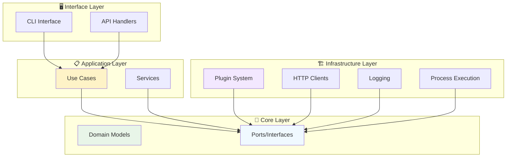
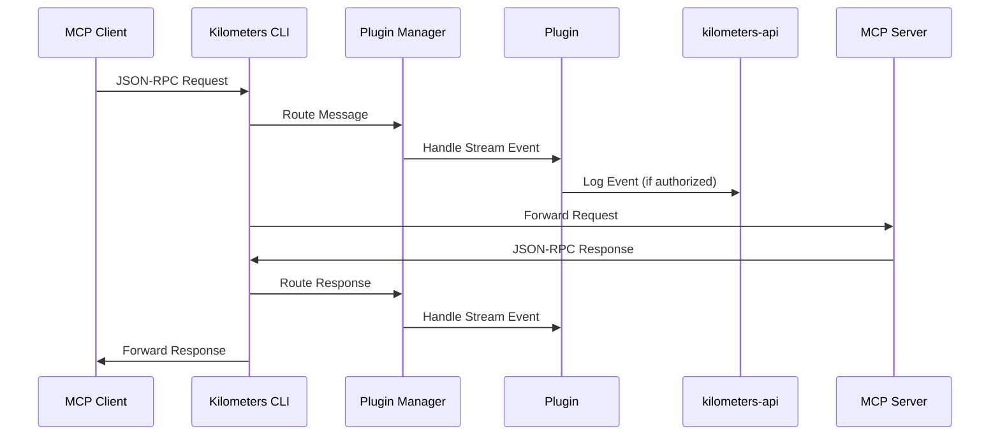
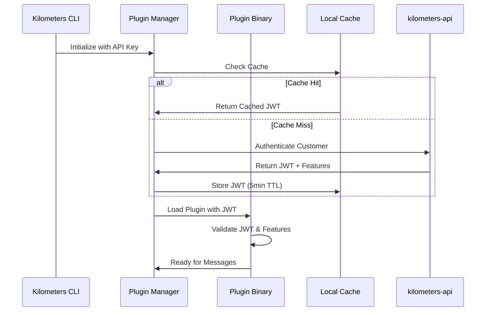
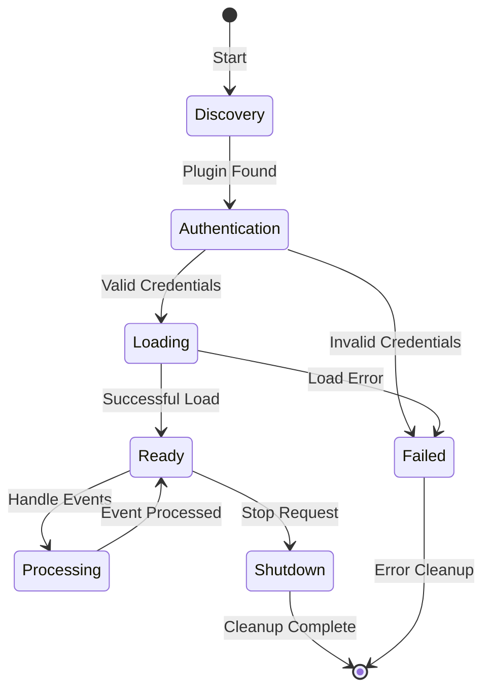
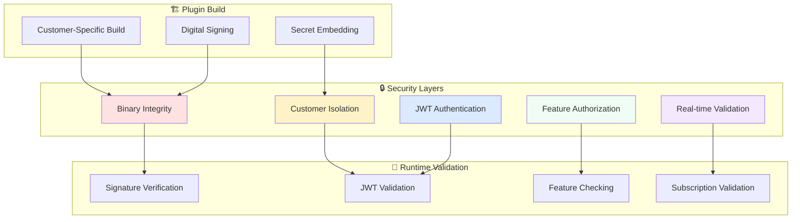
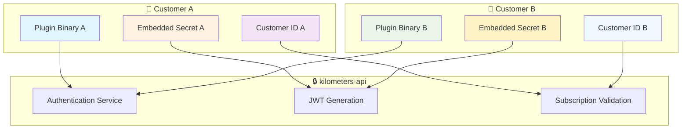
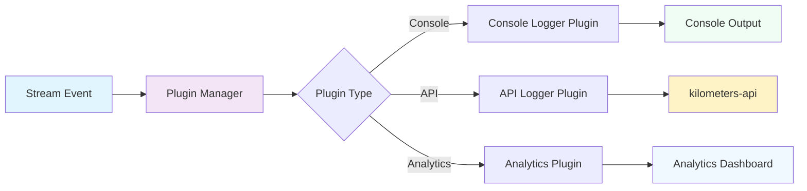
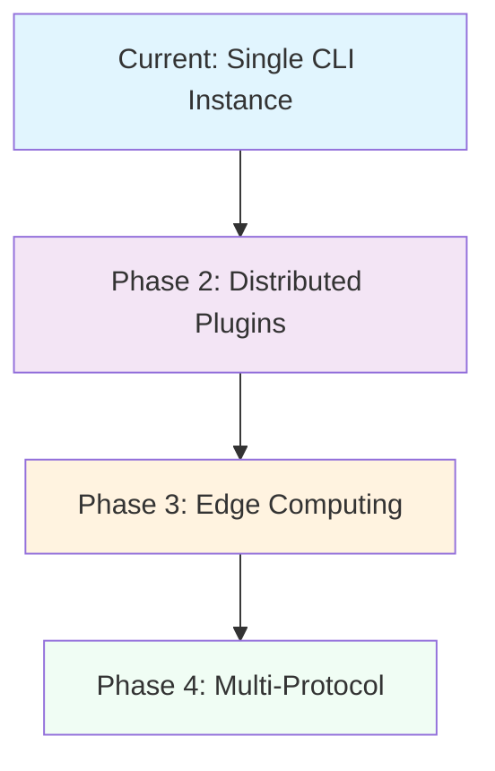

# 🏗️ **Architecture Guide**

Comprehensive guide to the Kilometers CLI system architecture, design patterns, and implementation details.

## 🎯 **System Overview**

Kilometers CLI is designed as a **transparent proxy** and **secure monitoring platform** for Model Context Protocol (MCP) servers, built with enterprise-grade security and extensibility.

### **Core Principles**

- **🔍 Transparency**: Zero-disruption MCP message interception
- **🔒 Security**: Multi-layer authentication and customer isolation  
- **🔌 Extensibility**: Plugin-based architecture for feature expansion
- **⚡ Performance**: Sub-millisecond proxy overhead
- **🏢 Enterprise**: Tier-based feature access and premium capabilities

## 🏛️ **Clean Architecture Overview**

The system follows **Clean Architecture** principles with **Hexagonal Architecture** patterns and **Domain-Driven Design** concepts.



## 📁 **Directory Structure**

```
kilometers-cli/
├── 📁 cmd/                          # 🚪 Application Entry Points
│   └── main.go                     # CLI application main
├── 📁 internal/                    # 🔒 Private Application Code
│   ├── 📁 application/             # 📋 Application Layer
│   │   └── services/               # Business logic services
│   │       ├── monitor_service.go  # Core monitoring orchestration
│   │       └── stream_proxy.go     # MCP message proxying
│   ├── 📁 core/                    # 🎯 Core Domain Layer
│   │   ├── domain/                 # Domain models and entities
│   │   │   ├── command.go          # CLI command models
│   │   │   ├── config.go           # Configuration models
│   │   │   └── jsonrpc.go          # JSON-RPC message models
│   │   └── ports/                  # Interface definitions (Hexagonal)
│   │       ├── plugins/            # Plugin interfaces
│   │       │   └── plugin.go       # Core plugin contracts
│   │       └── process.go          # Process execution interfaces
│   ├── 📁 infrastructure/          # 🏗️ Infrastructure Layer
│   │   ├── http/                   # HTTP client implementations
│   │   │   └── client.go           # kilometers-api HTTP client
│   │   ├── logging/                # Logging implementations
│   │   │   └── console_logger.go   # Console logging adapter
│   │   ├── plugins/                # Plugin system implementation
│   │   │   ├── manager.go          # Plugin lifecycle management
│   │   │   ├── discovery.go        # Plugin discovery and loading
│   │   │   ├── auth.go             # Authentication and caching
│   │   │   └── message_handler.go  # Plugin message routing
│   │   ├── process/                # Process execution
│   │   │   └── executor.go         # MCP server process management
│   │   └── storage/                # Data persistence (future)
│   └── 📁 interfaces/              # 🖥️ Interface Layer
│       └── cli/                    # CLI interface implementations
│           ├── flag_parser.go      # Command-line parsing
│           ├── init.go             # Initialization command
│           ├── monitor.go          # Monitoring command
│           └── root.go             # Root command setup
├── 📁 examples/                    # 🎓 Plugin Examples
│   └── plugins/                    # Sample plugin implementations
├── 📁 scripts/                     # 🛠️ Development Scripts
│   ├── build/                      # Build automation
│   ├── test/                       # Testing scripts
│   ├── install/                    # Installation scripts
│   └── plugin/                     # Plugin development tools
└── 📁 docs/                        # 📚 Documentation
    ├── development/                # Developer guides
    ├── plugins/                    # Plugin documentation
    └── installation/               # User guides
```

## 🔄 **Data Flow Architecture**

### **MCP Message Flow**



### **Plugin Authentication Flow**



## 🔌 **Plugin System Architecture**

### **Plugin Lifecycle**



### **Plugin Security Model**



## 🎯 **Core Components**

### **1. Monitor Service** (`application/services/monitor_service.go`)

**Responsibility**: Orchestrates the entire monitoring workflow

```go
type MonitoringService struct {
    executor     ports.ProcessExecutor    // MCP server process management
    logger       ports.MessageHandler     // Message logging (plugin-based)
    streamProxy  *StreamProxy            // JSON-RPC proxying
}

func (s *MonitoringService) StartMonitoring(ctx context.Context, config domain.MonitorConfig) error {
    // 1. Start MCP server process
    // 2. Initialize plugin system
    // 3. Start bidirectional proxy
    // 4. Handle graceful shutdown
}
```

**Key Features**:
- **Process Management**: Starts and monitors MCP server processes
- **Plugin Integration**: Initializes and manages plugin lifecycle
- **Proxy Coordination**: Coordinates message flow between client and server
- **Graceful Shutdown**: Ensures clean shutdown of all components

### **2. Stream Proxy** (`application/services/stream_proxy.go`)

**Responsibility**: Transparent JSON-RPC message proxying with event generation

```go
type StreamProxy struct {
    logger       ports.MessageHandler
    serverReader *bufio.Reader
    serverWriter *bufio.Writer
    clientReader *bufio.Reader
    clientWriter *bufio.Writer
}

func (p *StreamProxy) StartBidirectionalProxy(ctx context.Context) error {
    // Start goroutines for both directions
    go p.proxyClientToServer(ctx)
    go p.proxyServerToClient(ctx)
}
```

**Key Features**:
- **Bidirectional Proxying**: Handles both request and response streams
- **Event Generation**: Creates `StreamEvent` objects for plugin consumption
- **Zero Latency**: Sub-millisecond message forwarding
- **Error Resilience**: Continues operation despite individual message errors

### **3. Plugin Manager** (`infrastructure/plugins/manager.go`)

**Responsibility**: Plugin lifecycle management and message routing

```go
type PluginManager struct {
    plugins        map[string]*PluginInstance
    authenticator  *PluginAuthenticator
    discovery      *PluginDiscovery
    messageHandler *PluginMessageHandler
}

func (m *PluginManager) LoadPlugins(ctx context.Context, config PluginManagerConfig) error {
    // 1. Discover available plugins
    // 2. Authenticate with kilometers-api
    // 3. Load authorized plugins
    // 4. Initialize plugin instances
}
```

**Key Features**:
- **Plugin Discovery**: Automatic detection of plugin binaries
- **Authentication**: JWT-based plugin authentication
- **Lifecycle Management**: Initialize, run, and shutdown plugins
- **Message Routing**: Route stream events to appropriate plugins

### **4. Plugin Discovery** (`infrastructure/plugins/discovery.go`)

**Responsibility**: Plugin binary discovery and validation

```go
type PluginDiscovery struct {
    pluginDirs     []string
    binaryPrefix   string
    manifestCache  map[string]*PluginManifest
}

func (d *PluginDiscovery) DiscoverPlugins(ctx context.Context) ([]*PluginInfo, error) {
    // 1. Scan plugin directories
    // 2. Validate plugin binaries
    // 3. Parse plugin manifests
    // 4. Return plugin metadata
}
```

**Key Features**:
- **Directory Scanning**: Searches configured plugin directories
- **Binary Validation**: Verifies plugin binary integrity
- **Manifest Parsing**: Reads and validates plugin metadata
- **Caching**: Caches discovery results for performance

### **5. Plugin Authentication** (`infrastructure/plugins/auth.go`)

**Responsibility**: Plugin authentication and authorization with caching

```go
type PluginAuthenticator struct {
    apiClient   *http.Client
    cache       *AuthCache
    apiEndpoint string
}

func (a *PluginAuthenticator) AuthenticatePlugin(ctx context.Context, config AuthConfig) (*AuthResponse, error) {
    // 1. Check local cache (5-minute TTL)
    // 2. Authenticate with kilometers-api if cache miss
    // 3. Validate subscription tier and features
    // 4. Return JWT token and feature list
}
```

**Key Features**:
- **Local Caching**: 5-minute TTL for authentication results
- **API Integration**: Real-time validation with kilometers-api
- **Feature Authorization**: Tier-based feature access control
- **JWT Management**: Secure token generation and validation

## 🏢 **Enterprise Architecture**

### **Multi-Tenant Security**



### **Subscription Tiers**

| Component | Free | Pro | Enterprise |
|-----------|------|-----|------------|
| **Console Logging** | ✅ | ✅ | ✅ |
| **API Analytics** | ❌ | ✅ | ✅ |
| **Real-time Monitoring** | ❌ | ✅ | ✅ |
| **Advanced Analytics** | ❌ | ❌ | ✅ |
| **Custom Plugins** | ❌ | ❌ | ✅ |
| **Enterprise Support** | ❌ | ❌ | ✅ |

### **Performance Characteristics**

- **Proxy Latency**: Sub-millisecond message forwarding
- **Plugin Overhead**: Minimal impact on throughput
- **Memory Usage**: Efficient resource utilization
- **Authentication Cache**: 5-minute TTL for optimal balance

## 🔄 **Event-Driven Architecture**

### **Stream Event Processing**

```go
type StreamEvent struct {
    ID            string          `json:"id"`
    CorrelationID string          `json:"correlation_id"`
    Timestamp     time.Time       `json:"timestamp"`
    Type          StreamEventType `json:"type"`
    Direction     string          `json:"direction"`
    Message       json.RawMessage `json:"message"`
    ServerInfo    ServerInfo      `json:"server_info"`
    ClientInfo    ClientInfo      `json:"client_info"`
}

type StreamEventType string

const (
    StreamEventRequest     StreamEventType = "request"
    StreamEventResponse    StreamEventType = "response"
    StreamEventError       StreamEventType = "error"
    StreamEventServerStart StreamEventType = "server_start"
    StreamEventServerStop  StreamEventType = "server_stop"
)
```

### **Plugin Message Handling**



## 🔒 **Security Architecture**

### **Defense in Depth**

1. **Binary Level**: Digital signatures and integrity validation
2. **Customer Level**: Customer-specific binaries with embedded secrets
3. **Authentication Level**: JWT tokens with time-based expiration
4. **Authorization Level**: Feature-based access control
5. **API Level**: Real-time subscription validation
6. **Network Level**: TLS encryption for all API communication

### **Threat Model**

| Threat | Mitigation |
|--------|------------|
| **Binary Tampering** | Digital signatures, integrity checks |
| **Customer Impersonation** | Customer-specific embedded secrets |
| **Feature Bypass** | Server-side authorization validation |
| **Token Replay** | Time-based expiration, nonce validation |
| **Subscription Fraud** | Real-time API validation |
| **Man-in-the-Middle** | TLS encryption, certificate pinning |

## 📊 **Monitoring and Observability**

### **Internal Metrics**

The system tracks key performance and operational metrics:
- Proxy latency and throughput
- Plugin load times and health
- Authentication cache performance
- Error rates and patterns
- Active plugin monitoring

### **Health Checks**

- **Plugin Health**: Regular plugin responsiveness checks
- **API Connectivity**: kilometers-api connection validation
- **Process Health**: MCP server process monitoring
- **Memory Usage**: Memory leak detection and alerting
- **Performance**: Latency and throughput monitoring

## 🚀 **Scalability Considerations**

### **Horizontal Scaling**

- **Stateless Design**: No shared state between CLI instances
- **Plugin Isolation**: Independent plugin processes
- **API Caching**: Local authentication caching reduces API load
- **Event Buffering**: Asynchronous event processing

### **Vertical Scaling**

- **Memory Efficiency**: Minimal memory footprint per instance
- **CPU Optimization**: Efficient JSON parsing and message routing
- **I/O Performance**: Optimized stream processing
- **Plugin Performance**: Sub-millisecond plugin communication

## 🔮 **Future Architecture**

### **Planned Enhancements**

1. **Distributed Tracing**: OpenTelemetry integration
2. **Plugin Registry**: Centralized plugin distribution
3. **Real-time Analytics**: Live monitoring dashboards
4. **Multi-Protocol Support**: Support for non-MCP protocols
5. **Edge Computing**: Plugin execution at edge locations

### **Architecture Evolution**



## 📚 **Architecture References**

### **Design Patterns Used**

- **Hexagonal Architecture**: Ports and adapters pattern
- **Clean Architecture**: Dependency inversion and layered design
- **Domain-Driven Design**: Rich domain models and ubiquitous language
- **Plugin Architecture**: Extensible plugin system
- **Proxy Pattern**: Transparent message interception
- **Observer Pattern**: Event-driven plugin notifications
- **Strategy Pattern**: Pluggable authentication strategies
- **Factory Pattern**: Plugin and service creation

### **External Resources**

- **Clean Architecture**: [Robert C. Martin's Clean Architecture](https://blog.cleancoder.com/uncle-bob/2012/08/13/the-clean-architecture.html)
- **Hexagonal Architecture**: [Alistair Cockburn's Hexagonal Architecture](https://alistair.cockburn.us/hexagonal-architecture/)
- **Go-Plugin**: [HashiCorp go-plugin](https://github.com/hashicorp/go-plugin)
- **Domain-Driven Design**: [Eric Evans' DDD](https://domainlanguage.com/ddd/)

---

## 🤝 **Contributing to Architecture**

### **Architecture Decisions**

All significant architectural changes require:

1. **Architecture Decision Record (ADR)**
2. **Security impact assessment**
3. **Performance impact analysis**
4. **Backward compatibility review**
5. **Documentation updates**

### **Architecture Review Process**

1. **Proposal**: Submit architecture proposal
2. **Discussion**: Community and team review
3. **Prototype**: Proof-of-concept implementation
4. **Testing**: Performance and security validation
5. **Documentation**: Update architecture docs
6. **Implementation**: Gradual rollout

---

**For architecture questions, see [GitHub Discussions](https://github.com/kilometers-ai/kilometers-cli/discussions) or contact [architecture@kilometers.ai](mailto:architecture@kilometers.ai)**