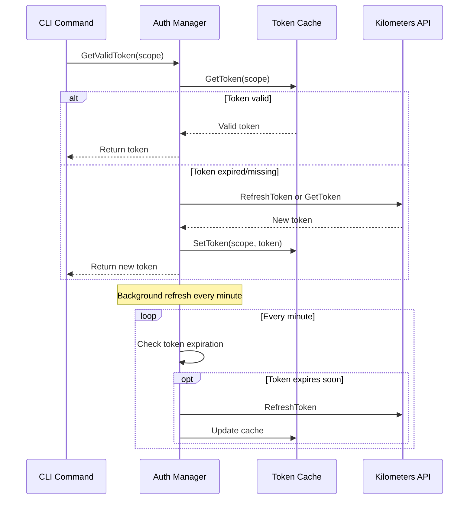

# Automatic Authentication Token Refresh

## Overview

The Kilometers CLI implements automatic authentication token refresh to ensure seamless API access without manual intervention. This feature automatically refreshes authentication tokens before they expire, handles token caching securely, and provides retry logic for resilience.

## Architecture

### Core Components

1. **AuthToken Domain Model** (`domain/auth_token.go`)
   - Represents authentication tokens with expiration tracking
   - Provides methods to check expiration and refresh needs
   - Supports refresh tokens for seamless renewal

2. **Auto-Refresh Manager** (`services/auth_refresh_service.go`)
   - Orchestrates token lifecycle management
   - Implements background refresh process
   - Handles retry logic and error recovery

3. **Token Provider** (`infrastructure/auth/token_provider.go`)
   - HTTP client for token acquisition and refresh
   - Communicates with Kilometers API
   - Supports multiple grant types

4. **Token Cache** (`infrastructure/auth/token_cache.go`)
   - Secure file-based caching with encryption
   - In-memory cache for testing
   - Preserves tokens across CLI invocations

### Flow Diagram



## Features

### 1. Automatic Refresh
- Tokens are refreshed 5 minutes before expiration (configurable)
- Background process checks tokens every minute
- No manual intervention required

### 2. Secure Caching
- Tokens encrypted using machine-specific keys
- File permissions restricted to user only
- Cache cleared on security events

### 3. Retry Logic
- Configurable retry attempts (default: 3)
- Exponential backoff between retries
- Graceful fallback to API key authentication

### 4. Concurrent Request Handling
- Only one refresh per scope at a time
- Other requests wait for ongoing refresh
- Prevents token refresh storms

## Configuration

### Default Settings
```go
config := &AutoRefreshConfig{
    RefreshAhead:  5 * time.Minute,  // Refresh 5 min before expiry
    RetryInterval: 30 * time.Second, // Wait between retries
    MaxRetries:    3,                // Max retry attempts
    CheckInterval: 1 * time.Minute,  // Background check frequency
}
```

### Environment Variables
```bash
# Override default API endpoint
export KILOMETERS_API_ENDPOINT=https://api.kilometers.ai

# Disable token caching (not recommended)
export KM_NO_TOKEN_CACHE=1
```

## Usage

### In CLI Commands
```go
// Create auth manager
authManager, err := auth.CreateAuthManager(config)
if err != nil {
    return err
}

// Get valid token automatically
token, err := authManager.GetValidToken(ctx, "monitoring")
if err != nil {
    return err
}

// Use token in API calls
req.Header.Set("Authorization", fmt.Sprintf("Bearer %s", token.Token))
```

### With HTTP Client
```go
// Create authenticated HTTP client
client := CreateAuthenticatedClient(authManager, "plugins")

// All requests automatically authenticated
resp, err := client.Do(req)
```

## Testing

### Unit Tests
```bash
go test ./internal/application/services -v -run TestAutoRefresh
```

### Test Coverage
- Token expiration detection
- Refresh token flow
- API key fallback
- Concurrent refresh handling
- Retry logic
- Cache operations

## Security Considerations

1. **Token Storage**
   - Encrypted at rest using AES-256-GCM
   - Machine-specific encryption keys
   - Restricted file permissions (0600)

2. **Token Rotation**
   - Automatic refresh prevents stale tokens
   - Refresh tokens single-use when possible
   - Force refresh on security events

3. **Error Handling**
   - Failed refreshes fall back to API key
   - Tokens never logged in plaintext
   - Cache corruption handled gracefully

## Troubleshooting

### Common Issues

1. **Token refresh failures**
   ```bash
   # Check API connectivity
   curl -I https://api.kilometers.ai/health
   
   # Clear token cache
   rm ~/.config/kilometers/.auth_cache
   ```

2. **Permission errors**
   ```bash
   # Fix cache file permissions
   chmod 600 ~/.config/kilometers/.auth_cache
   ```

3. **Debugging**
   ```bash
   # Enable debug logging
   export KM_DEBUG=true
   km monitor --server -- [command]
   ```

## Future Enhancements

1. **Token Revocation**
   - Support explicit token revocation
   - Clear cache on revocation events

2. **Multi-Account Support**
   - Cache tokens per account/profile
   - Switch between accounts seamlessly

3. **Token Analytics**
   - Track token usage patterns
   - Alert on unusual refresh patterns

4. **Offline Mode**
   - Extended token lifetime for offline use
   - Queue operations when offline
