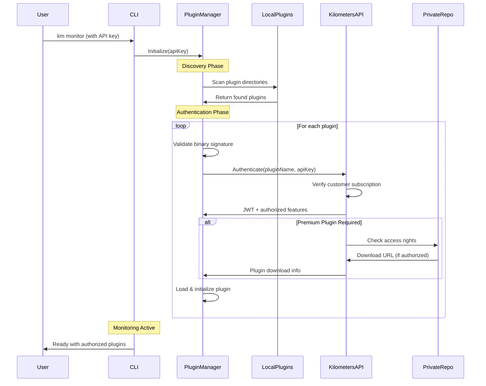
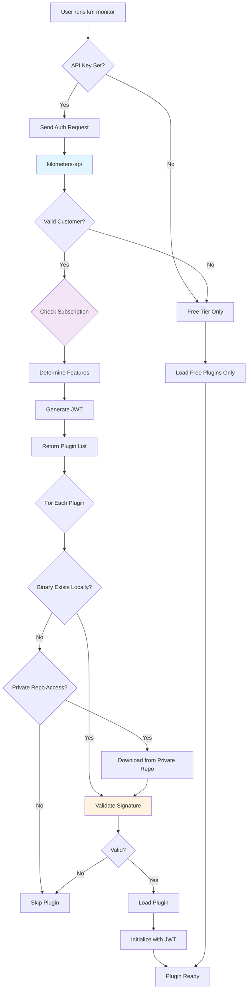

# 🔨 **Build, Run & Test Guide**

Complete guide for building, running, and testing the Kilometers CLI, including plugin authentication and private repository access.

## 📋 **Table of Contents**

- [Build Commands](#-build-commands)
- [Run Commands](#-run-commands)
- [Test Commands](#-test-commands)
- [Plugin Authentication System](#-plugin-authentication-system)
- [Private Repo Plugins](#-private-repo-plugins)

---

## 🔨 **Build Commands**

### **Basic Build**

The simplest way to build the Kilometers CLI:

```bash
# Build the CLI binary
go build -o km ./cmd/main.go

# Run the built binary
./km --help
```

### **Production Build with Version Info**

Include version information for production builds:

```bash
# Build with version, commit, and date information
go build -ldflags="-X main.version=1.0.0 -X main.commit=$(git rev-parse HEAD) -X main.date=$(date -u +%Y-%m-%d)" -o km ./cmd/main.go

# Verify version information
./km --version
# Output: km version 1.0.0 (commit: abc123, built: 2024-01-15)
```

### **Cross-Platform Builds**

Build for multiple platforms using the provided script:

```bash
# Use the build script for all supported platforms
./scripts/build/build-releases.sh

# This creates binaries for:
# - Linux: amd64, arm64
# - macOS: amd64 (Intel), arm64 (Apple Silicon)
# - Windows: amd64

# Output will be in releases/ directory:
# releases/
#   ├── km-linux-amd64
#   ├── km-linux-arm64
#   ├── km-darwin-amd64
#   ├── km-darwin-arm64
#   └── km-windows-amd64.exe
```

### **Development Build Options**

```bash
# Debug build with symbols
go build -gcflags="all=-N -l" -o km-debug ./cmd/main.go

# Build with race detection (for testing)
go build -race -o km-race ./cmd/main.go

# Minimal size build
go build -ldflags="-s -w" -o km-minimal ./cmd/main.go
```

### **Customer-Specific Plugin Builds**

Build plugins for specific customers with embedded authentication:

```bash
# Build a plugin for a specific customer
./scripts/plugin/build-plugin.sh \
  --plugin=api-logger \
  --customer=cust_123 \
  --api-key=km_live_abc123 \
  --tier=Pro

# Build enterprise plugin with all features
./scripts/plugin/build-plugin.sh \
  --plugin=enterprise-analytics \
  --customer=enterprise_456 \
  --api-key=km_live_enterprise456 \
  --tier=Enterprise \
  --debug

# Output: dist/km-plugin-{name}-{customer-hash}.kmpkg
```

---

## 🚀 **Run Commands**

### **Basic Monitoring**

Monitor MCP servers with different configurations:

```bash
# Basic monitoring (console output only)
./km monitor --server -- npx -y @modelcontextprotocol/server-github

# Monitor Python-based MCP server
./km monitor --server -- python -m my_mcp_server

# Monitor Docker-based MCP server
./km monitor --server -- docker run my-mcp-server

# Monitor with custom buffer size for large payloads
./km monitor --buffer-size 2MB --server -- your-mcp-server
```

### **With Authentication (Premium Features)**

Enable premium features by setting your API key:

```bash
# Set API key environment variable
export KM_API_KEY="km_live_your_api_key"

# Or use inline
KM_API_KEY="km_live_your_api_key" ./km monitor --server -- your-mcp-server

# With custom API endpoint
./km monitor --endpoint https://api.kilometers.ai --server -- your-mcp-server

# With configuration file
./km monitor --config ~/.km/config.json --server -- your-mcp-server
```

### **Advanced Run Options**

```bash
# Enable debug mode
export KM_DEBUG=true
./km monitor --server -- your-mcp-server

# Set log format
export KM_LOG_FORMAT=json
./km monitor --server -- your-mcp-server

# Run with specific plugins
./km monitor --plugins api-logger,advanced-analytics --server -- your-mcp-server

# Disable specific plugins
./km monitor --disable-plugins console-logger --server -- your-mcp-server
```

### **Configuration File Example**

Create `~/.km/config.json`:

```json
{
  "api_key": "km_live_your_api_key",
  "api_endpoint": "https://api.kilometers.ai",
  "debug": false,
  "log_format": "json",
  "monitor": {
    "buffer_size": "2MB",
    "timeout": "30s"
  },
  "plugins": {
    "directories": [
      "~/.km/plugins/",
      "/usr/local/share/km/plugins/"
    ],
    "enabled": ["api-logger", "advanced-analytics"],
    "disabled": []
  }
}
```

---

## 🧪 **Test Commands**

### **Using the Test Script**

The project includes a comprehensive test script with advanced features:

```bash
# Run all tests with default settings
./scripts/test/run-tests.sh

# Run with verbose output
./scripts/test/run-tests.sh --verbose

# Run with coverage reporting
./scripts/test/run-tests.sh --coverage

# Run specific test suites
./scripts/test/run-tests.sh ./internal/core/domain/...
./scripts/test/run-tests.sh ./internal/application/...

# Run without race detection (faster)
./scripts/test/run-tests.sh --no-race

# Set custom timeout
./scripts/test/run-tests.sh --timeout 60
```

### **Direct Go Test Commands**

Use Go's built-in test commands directly:

```bash
# Run all tests
go test ./...

# Run with race detection
go test -race ./...

# Run with coverage
go test -cover ./...
go test -coverprofile=coverage.out ./...
go tool cover -html=coverage.out -o coverage.html

# Run specific package tests
go test ./internal/core/domain/...
go test ./internal/infrastructure/plugins/...

# Run with verbose output
go test -v ./...

# Run with timeout
go test -timeout 30s ./...

# Run specific test by name
go test -run TestPluginManager ./internal/infrastructure/plugins/...

# Benchmark tests
go test -bench=. ./...
go test -bench=BenchmarkMessageHandling ./internal/core/...
```

### **Integration Tests**

```bash
# Run MCP monitoring integration test
./scripts/test/test-mcp-monitoring.sh

# Run plugin integration tests
./scripts/test/test-plugin-integration.sh

# Test with real MCP servers
./km monitor --test-mode --server -- npx -y @modelcontextprotocol/server-filesystem /tmp
```

### **Test Environment Variables**

```bash
# Enable test mode
export KM_TEST_MODE=true

# Set test timeout
export TEST_TIMEOUT=120

# Enable verbose test output
export VERBOSE=true

# Enable coverage collection
export COVERAGE=true

# Disable race detection
export RACE_DETECTION=false
```

---

## 🔐 **Plugin Authentication System**

The Kilometers CLI implements a sophisticated multi-layer security system for plugin authentication and access control.

### **How It Works**



### **Security Layers**

#### **1. Customer-Specific Binaries**

Each plugin is built uniquely for each customer with embedded credentials:

```go
// Embedded at build time for each customer
const (
    EmbeddedCustomerID    = "cust_123"
    EmbeddedCustomerToken = "km_customer_8f3a2b1c..."
    EmbeddedAPIKeyHash    = "sha256:a1b2c3d4e5f6..."
    TargetTier           = "Pro"
    BuildTimestamp       = "1704067200"
)
```

#### **2. Binary Signature Validation**

All plugin binaries are digitally signed:

```bash
# Plugin package structure
km-plugin-api-logger-abc123.kmpkg/
├── km-plugin-api-logger-abc123      # The binary
├── km-plugin-api-logger-abc123.sig  # Digital signature
└── km-plugin-api-logger-abc123.manifest  # Metadata
```

#### **3. JWT-Based Authentication**

Plugins receive JWT tokens with embedded permissions:

```json
{
  "customer_id": "cust_123",
  "subscription_tier": "Pro",
  "authorized_features": [
    "console_logging",
    "api_logging",
    "advanced_analytics"
  ],
  "plugin_access": {
    "api-logger": true,
    "enterprise-analytics": false
  },
  "exp": 1704070800,
  "iat": 1704067200
}
```

#### **4. Real-Time Validation**

Authentication is validated every 5 minutes:

```go
// Plugin manager refreshes authentication periodically
func (pm *PluginManager) backgroundRefresh() {
    ticker := time.NewTicker(5 * time.Minute)
    for {
        select {
        case <-ticker.C:
            pm.refreshAuthentications()
        case <-pm.shutdownChan:
            return
        }
    }
}
```

### **Subscription Tiers & Features**

| Tier | Features | Plugin Access |
|------|----------|---------------|
| **Free** | • Console logging<br>• Basic monitoring | • console-logger |
| **Pro** | • API integration<br>• Real-time analytics<br>• Advanced filtering | • console-logger<br>• api-logger<br>• analytics |
| **Enterprise** | • Team collaboration<br>• Compliance reporting<br>• Custom plugins<br>• Priority support | • All plugins<br>• Custom plugins<br>• Private repo access |

---

## 🔒 **Private Repo Plugins**

### **How Private Repo Access Works**

1. **Customer Authentication**
   - CLI sends API key to kilometers-api
   - API verifies customer subscription and tier

2. **Plugin Access Check**
   - API checks if customer has access to requested private plugins
   - For Enterprise customers, checks custom plugin registry

3. **Secure Download**
   - API generates time-limited download URL
   - Plugin binary downloaded to local cache
   - Binary signature verified before loading

### **Private Plugin Discovery**

```go
// Plugin discovery checks multiple sources
type PluginSource struct {
    Type     string // "local", "public", "private"
    Location string // File path or repository URL
    Auth     *AuthInfo
}

func (pm *PluginManager) discoverPlugins() ([]PluginInfo, error) {
    var plugins []PluginInfo
    
    // 1. Local plugins (always available)
    localPlugins := pm.discoverLocalPlugins()
    plugins = append(plugins, localPlugins...)
    
    // 2. Public plugins (tier-based)
    if pm.hasAccess("public_registry") {
        publicPlugins := pm.discoverPublicPlugins()
        plugins = append(plugins, publicPlugins...)
    }
    
    // 3. Private plugins (Enterprise only)
    if pm.hasAccess("private_registry") {
        privatePlugins := pm.discoverPrivatePlugins()
        plugins = append(plugins, privatePlugins...)
    }
    
    return plugins, nil
}
```

### **Customer-Specific Plugin Registry**

Enterprise customers get access to private plugin registries:

```json
{
  "customer_id": "enterprise_456",
  "private_registry": {
    "url": "https://plugins.kilometers.ai/private/enterprise_456",
    "access_token": "token_xxx",
    "available_plugins": [
      {
        "name": "custom-compliance-reporter",
        "version": "2.1.0",
        "tier": "Enterprise",
        "download_url": "https://secure-download.kilometers.ai/..."
      },
      {
        "name": "team-collaboration-hub",
        "version": "1.5.0",
        "tier": "Enterprise",
        "download_url": "https://secure-download.kilometers.ai/..."
      }
    ]
  }
}
```

### **Plugin Installation from Private Repo**

```bash
# List available plugins (includes private for Enterprise)
km plugin list --include-private

# Install private plugin (Enterprise only)
km plugin install custom-compliance-reporter

# Install specific version
km plugin install custom-compliance-reporter@2.1.0

# Update all plugins
km plugin update --all
```

### **Security Considerations**

1. **Download Security**
   - HTTPS only for all downloads
   - Time-limited URLs (expire after 5 minutes)
   - IP-restricted downloads for Enterprise

2. **Binary Verification**
   - SHA256 checksum validation
   - RSA signature verification
   - Customer ID embedded validation

3. **Runtime Security**
   - Plugins run in isolated processes
   - Limited system access based on manifest
   - Automatic termination on auth failure

---

## 📊 **Authentication Flow Diagram**



---

## 🔧 **Troubleshooting**

### **Build Issues**

```bash
# Clear build cache
go clean -cache

# Update dependencies
go mod tidy
go mod download

# Verify module integrity
go mod verify
```

### **Authentication Issues**

```bash
# Test API key
km auth test

# Check plugin permissions
km plugin list --show-permissions

# Debug authentication
export KM_DEBUG=true
export KM_AUTH_DEBUG=true
km monitor --server -- test-server
```

### **Plugin Loading Issues**

```bash
# Verify plugin signatures
km plugin verify

# Clear plugin cache
rm -rf ~/.km/plugin-cache/

# Reinstall plugins
km plugin reinstall --all
```

---

## 📚 **Additional Resources**

- [Getting Started Guide](GETTING_STARTED.md)
- [Architecture Overview](ARCHITECTURE.md)
- [Plugin Development](../plugins/DEVELOPMENT.md)
- [Script Reference](SCRIPT_REFERENCE.md)

---

**Need help?** Check our [GitHub Discussions](https://github.com/kilometers-ai/kilometers-cli/discussions) or [contact support](mailto:support@kilometers.ai).
