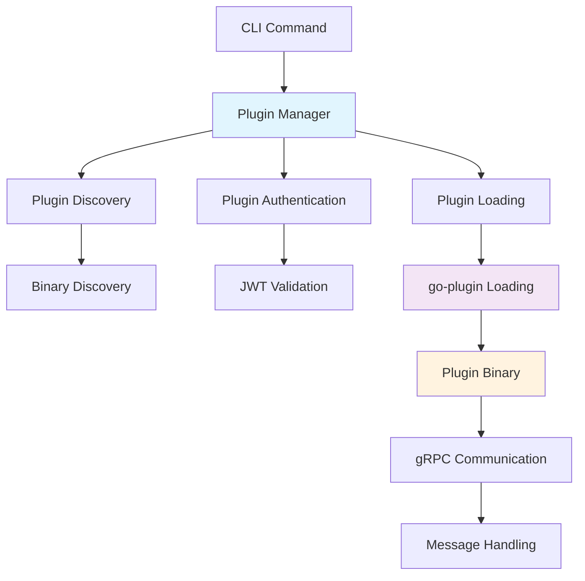

# 🛠️ **Developer Getting Started Guide**

Welcome to Kilometers CLI development! This guide will help you set up your development environment and understand the project structure.

## 📋 **Prerequisites**

- **Go 1.21+**: [Install Go](https://golang.org/doc/install)
- **Git**: [Install Git](https://git-scm.com/downloads)
- **Docker** (optional): For containerized development
- **Make** (optional): For build automation

## 🚀 **Quick Setup**

### **1. Clone and Setup**

```bash
# Clone the repository
git clone https://github.com/kilometers-ai/kilometers-cli.git
cd kilometers-cli

# Install dependencies
go mod download

# Verify setup
go build -o km ./cmd/main.go
./km --help
```

### **2. Run Tests**

```bash
# Run all tests
./scripts/test/run-tests.sh

# Run with coverage
./scripts/test/run-tests.sh --coverage

# Test specific functionality
go test ./internal/...
```

> 📖 **For comprehensive build, run, and test commands, see the [Build, Run & Test Guide](BUILD_RUN_TEST.md)**

### **3. Development Build**

```bash
# Quick development build
go build -o km ./cmd/main.go

# With debug symbols
go build -gcflags="all=-N -l" -o km-debug ./cmd/main.go

# Test the build
./km --version
```

## 📁 **Project Structure**

The project follows Clean Architecture principles:

- **`cmd/`** - Application entry points
- **`internal/`** - Private application code organized in layers:
  - `application/` - Business logic services
  - `core/` - Domain models and interfaces
  - `infrastructure/` - External system adapters
  - `interfaces/` - CLI and external interfaces
- **`examples/`** - Plugin examples and demos
- **`scripts/`** - Development automation scripts
- **`docs/`** - Developer documentation  
- **`memory-bank/`** - Project context and decisions

## 🏗️ **Architecture Overview**

### **Clean Architecture Layers**

1. **Core Layer** (`internal/core/`)
   - **Domain**: Business entities and rules
   - **Ports**: Interface definitions (dependency inversion)

2. **Application Layer** (`internal/application/`)
   - **Services**: Use cases and business logic
   - **Orchestration**: Cross-cutting concerns

3. **Infrastructure Layer** (`internal/infrastructure/`)
   - **Adapters**: External service implementations
   - **Plugins**: Plugin system implementation
   - **Storage**: Data persistence

4. **Interface Layer** (`internal/interfaces/`)
   - **CLI**: Command-line interface
   - **Adapters**: Input/output handling

### **Plugin Architecture**



## 🔧 **Development Workflow**

### **1. Feature Development**

```bash
# Create feature branch
git checkout -b feature/your-feature-name

# Make changes and test
go build -o km-dev ./cmd/main.go
./scripts/test/run-tests.sh

# Run integration tests
./scripts/test/test-plugin-integration.sh
```

### **2. Plugin Development**

```bash
# Build example plugins
cd examples/plugins/console-logger
go build -o console-logger main.go

# Test plugin integration
cd ../../..
./scripts/plugin/demo-security-model.sh
```

### **3. Testing Strategy**

```bash
# Unit tests
go test ./internal/core/...
go test ./internal/application/...

# Integration tests
./scripts/test/test-mcp-monitoring.sh

# Plugin tests
./scripts/test/test-plugin-integration.sh

# Full test suite
./scripts/test/run-tests.sh
```

## 🧪 **Testing Guidelines**

### **Unit Testing**

- Test domain logic in `internal/core/`
- Mock external dependencies
- Use table-driven tests for multiple scenarios
- Aim for >80% code coverage

### **Integration Testing**

- Test CLI commands end-to-end
- Test plugin loading and communication
- Test MCP server integration
- Use real but isolated environments

### **Plugin Testing**

- Test plugin discovery and loading
- Test authentication and authorization
- Test message handling and forwarding
- Test error handling and graceful degradation

## 🔌 **Plugin Development**

### **Creating a New Plugin**

1. **Define Plugin Interface**

```go
type KilometersPlugin interface {
    Initialize(ctx context.Context, config PluginConfig) error
    HandleStreamEvent(ctx context.Context, event StreamEvent) error
    Shutdown(ctx context.Context) error
}
```

2. **Implement gRPC Communication**

```go
type PluginGRPCServer struct {
    plugin KilometersPlugin
}

func (s *PluginGRPCServer) HandleStreamEvent(ctx context.Context, req *HandleStreamEventRequest) (*HandleStreamEventResponse, error) {
    // Implementation
}
```

3. **Build and Test**

```bash
# Build plugin
go build -o my-plugin main.go

# Test with demo script
./scripts/plugin/demo-security-model.sh
```

## 📝 **Code Style and Standards**

### **Go Standards**

- Follow [Effective Go](https://golang.org/doc/effective_go.html)
- Use `gofmt` and `golint`
- Write meaningful variable and function names
- Add comments for exported functions

### **Architecture Patterns**

- **Dependency Injection**: Use interfaces for external dependencies
- **Clean Architecture**: Respect layer boundaries
- **Hexagonal Architecture**: Implement ports and adapters pattern
- **Domain-Driven Design**: Model business logic in domain layer

### **Error Handling**

```go
// Wrap errors with context
if err != nil {
    return fmt.Errorf("failed to initialize plugin: %w", err)
}

// Use structured logging
logger.Error("plugin authentication failed",
    "plugin", pluginName,
    "customer", customerID,
    "error", err)
```

## 🐛 **Debugging**

### **Debug Mode**

```bash
# Run with debug logging
export KM_DEBUG=true
./km monitor --debug -- your-mcp-server

# Debug plugin loading
export KM_PLUGIN_DEBUG=true
./km monitor -- your-mcp-server
```

### **Common Debugging Scenarios**

1. **Plugin Loading Issues**
   - Check plugin binary exists and is executable
   - Verify plugin manifest is valid JSON
   - Check authentication and API key validity

2. **MCP Communication Issues**
   - Enable debug logging to see JSON-RPC messages
   - Check proxy is correctly forwarding messages
   - Verify MCP server is running and responding

3. **Authentication Issues**
   - Verify API key is valid and not expired
   - Check network connectivity to kilometers-api
   - Validate JWT token structure and claims

## 🚀 **Performance Considerations**

### **Plugin Performance**

- **Minimize Latency**: Plugins should add <1ms overhead
- **Async Processing**: Use goroutines for non-blocking operations
- **Resource Management**: Properly close connections and files
- **Memory Usage**: Avoid memory leaks in long-running plugins

### **Monitoring Performance**

```bash
# Profile CPU usage
go tool pprof http://localhost:6060/debug/pprof/profile

# Profile memory usage
go tool pprof http://localhost:6060/debug/pprof/heap

# Benchmark tests
go test -bench=. ./internal/...
```

## 📚 **Additional Resources**

- **[Build, Run & Test Guide](BUILD_RUN_TEST.md)** - Comprehensive build, run, and test commands
- **[Architecture Guide](ARCHITECTURE.md)** - Detailed system design
- **[Script Reference](SCRIPT_REFERENCE.md)** - Complete script documentation
- **[Plugin Development](../plugins/DEVELOPMENT.md)** - Plugin creation guide

## 🤝 **Getting Help**

- **Documentation**: Check existing docs in `docs/`
- **Issues**: Search and create GitHub issues
- **Discussions**: Use GitHub Discussions for questions
- **Memory Bank**: Check `memory-bank/` for project context

---

**Happy developing! 🚀**