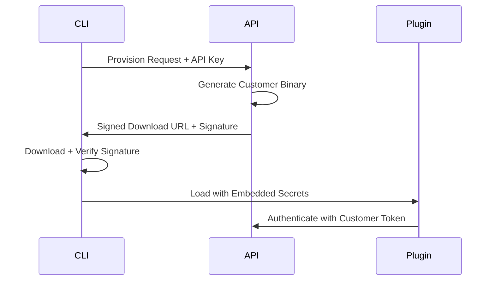

# Plugin Security Model

This document outlines the security architecture for the Kilometers CLI plugin system, covering IP protection, binary signing, and customer isolation mechanisms.

## Overview

The Kilometers CLI implements a dual-repository security model that separates public infrastructure from proprietary plugin implementations, ensuring both IP protection and secure distribution.

## Architecture

### Repository Split

**Public Repository (`kilometers-cli`)**
- Contains plugin runtime infrastructure
- Contains public RSA verification key
- Contains plugin interfaces and contracts
- **Cannot create valid plugin binaries** (no private key)

**Private Repository (plugin source + distribution)**
- Contains plugin implementation source code
- Contains private RSA signing key
- Contains customer-specific build pipeline
- Controls plugin distribution through API

### Security Benefits

This split provides multiple layers of protection:

1. **IP Protection** - Core plugin logic remains proprietary
2. **Ecosystem Control** - Only signed plugins can be distributed
3. **Revenue Protection** - Cannot bypass subscription tier restrictions
4. **Brand Protection** - Cannot distribute modified/malicious versions

## Binary Signing Process

### Key Management

```bash
# Public key (embedded in CLI binary)
const DefaultPublicKey = `-----BEGIN PUBLIC KEY-----
MIIBIjANBgkqhkiG9w0BAQEFAAOCAQ8AMIIBCgKCAQEAwykbNTfMQ4vJeFwK1YwV
...
-----END PUBLIC KEY-----`

# Private key (secured in private infrastructure)
PLUGIN_SIGNING_KEY=/secure/path/to/private.key
```

### Signing Workflow

1. **Plugin Build** - Customer-specific binaries generated per subscription tier
2. **Digital Signing** - Each binary signed with private RSA key
3. **Signature Embedding** - Base64 signature included in distribution metadata
4. **Secure Distribution** - Time-limited signed URLs for downloads

### Verification Process

```go
// CLI verifies each plugin before loading
func (d *SecurePluginDownloader) VerifySignature(pluginData []byte, signature string) error {
    // 1. Decode base64 signature
    sigBytes, err := base64.StdEncoding.DecodeString(signature)
    
    // 2. Calculate SHA256 hash of plugin data
    hashed := sha256.Sum256(pluginData)
    
    // 3. Verify RSA signature using embedded public key
    err = rsa.VerifyPKCS1v15(d.publicKey, crypto.SHA256, hashed[:], sigBytes)
    
    return err
}
```

## Customer Isolation

### Per-Customer Plugin Generation

Each customer receives unique plugin binaries with:

- **Embedded Customer Secrets** - Authentication tokens baked into binary
- **Subscription Tier Enforcement** - Only authorized features included
- **Customer-Specific Hash** - Unique identifier in binary name

```
Plugin Naming: km-plugin-{NAME}-{CUSTOMER_HASH}
Example: km-plugin-console-logger-abc123def456
```

### Authentication Flow



## Security Considerations

### Attack Scenarios Prevented

1. **Binary Tampering** - RSA signature verification prevents modification
2. **Unauthorized Plugin Creation** - Private key required for valid signatures
3. **Tier Bypass** - Customer-specific binaries enforce subscription limits
4. **Account Sharing** - Customer secrets embedded per binary
5. **IP Theft** - Plugin source code never distributed

### Potential Vulnerabilities

1. **Private Key Compromise** - Single point of failure for entire system
2. **Replay Attacks** - Same customer binary can be shared
3. **Reverse Engineering** - Binary analysis could reveal embedded secrets
4. **Key Rotation** - Difficult to update embedded public keys in distributed CLI

## Recommended Enhancements

### Hardware Security Module (HSM)

For production deployment, consider HSM-based signing:

```yaml
signing-infrastructure:
  hsm: aws-cloudhsm-cluster
  key-storage: hardware-backed
  access-control: multi-party-approval
  audit-logging: comprehensive
```

### Device-Bound Authentication

Enhanced security through device attestation:

```go
type DeviceAuth struct {
    DeviceID     string // Hardware fingerprint
    Certificate  *x509.Certificate // Signed by Kilometers CA
    Challenge    []byte // Proof of device possession
}
```

### Key Rotation Strategy

```yaml
key-rotation:
  schedule: quarterly
  backward-compatibility: 2-generations
  emergency-revocation: immediate
  cli-update: automatic
```

## Implementation Guidelines

### Private Key Protection

1. **Never commit private keys to any repository**
2. **Use environment variables or HSM for key access**
3. **Implement key rotation procedures**
4. **Maintain audit logs of all signing operations**

### Build Pipeline Security

```dockerfile
# Secure build environment
FROM secure-base-image
RUN --mount=type=secret,id=signing_key \
    sign-plugin --key=/run/secrets/signing_key plugin.bin
```

### Distribution Security

1. **Time-limited download URLs** (1 hour expiry)
2. **Customer-specific CDN paths**
3. **Download audit logging**
4. **Rate limiting and abuse detection**

## Monitoring and Alerting

### Key Metrics

- Plugin download success/failure rates
- Signature verification failures
- Unusual download patterns per customer
- Private key access attempts

### Alert Conditions

- Multiple signature verification failures
- Suspicious geographic download patterns
- Private key access outside business hours
- Plugin binaries found in public locations

## Compliance Considerations

### Data Protection

- Customer secrets embedded in binaries are considered sensitive data
- GDPR considerations for customer identification in plugin names
- Data retention policies for download logs

### Security Auditing

- Regular security reviews of signing infrastructure
- Penetration testing of plugin distribution system
- Code reviews for all signature-related functionality

## Migration Path

For transitioning to enhanced security:

1. **Phase 1** - Implement device registration during `km init`
2. **Phase 2** - Add device-bound plugin encryption
3. **Phase 3** - Migrate to HSM-based signing
4. **Phase 4** - Implement hardware attestation

This phased approach maintains backward compatibility while progressively hardening security.