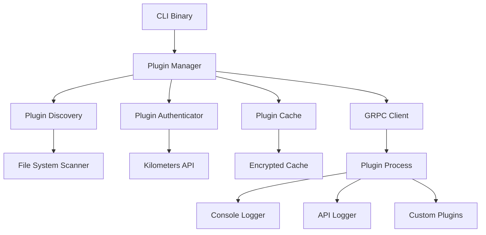
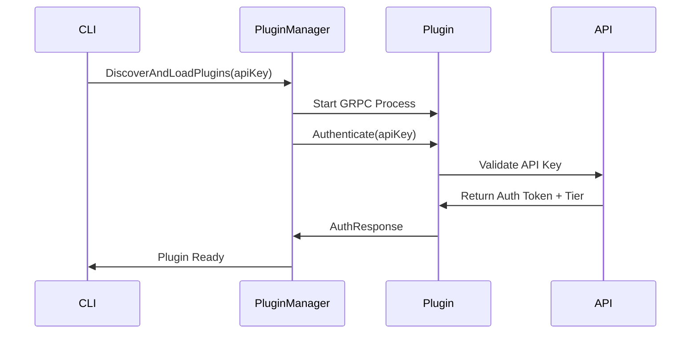
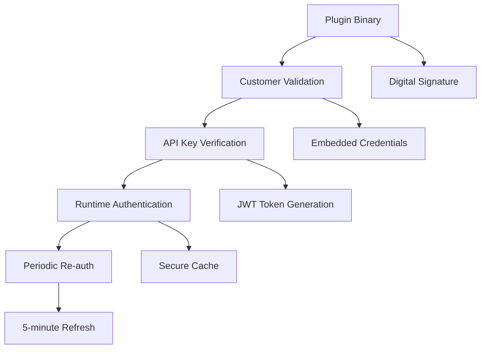

# Plugin System Automation Guide

This guide provides comprehensive documentation for automating the cleanup, building, and testing of the Kilometers CLI plugin system.

## Overview

The Kilometers CLI plugin system uses a **real go-plugin framework** with GRPC communication for isolated plugin execution. This automation system ensures clean development and testing workflows by:

1. **Complete Binary Cleanup** - Removes all prebuilt binaries from both repositories
2. **Fresh Plugin Building** - Builds new plugins from source code
3. **Comprehensive Testing** - Tests all plugin commands and monitoring integration
4. **Developer Documentation** - Provides clear process flows and usage instructions

## Quick Start

### Automated Cleanup and Testing

```bash
# Run the complete automation suite
./scripts/automation/cleanup-and-test-plugins.sh

# This will:
# 1. Remove all prebuilt binaries
# 2. Build fresh CLI and plugin binaries
# 3. Test all plugin commands
# 4. Test monitoring integration
# 5. Generate comprehensive report
```

### Manual Plugin Management

```bash
# Build CLI binary
go build -o km ./cmd/main.go

# Build plugin examples
cd examples/plugins/console-logger
go build -o km-plugin-console-logger ./main.go

# Install plugin to user directory
mkdir -p ~/.km/plugins
cp km-plugin-console-logger ~/.km/plugins/

# Test plugin functionality
KM_API_KEY=test-key ./km plugins list
KM_API_KEY=test-key ./km plugins status
```

## Architecture Overview

### Plugin System Components



### Authentication Flow



## Directory Structure

### Repository Layout

```
kilometers-cli/
├── cmd/main.go                           # CLI entry point
├── internal/infrastructure/plugins/      # Plugin infrastructure
│   ├── auth/                            # Authentication components
│   ├── discovery/                       # Plugin discovery
│   ├── grpc/                           # GRPC configuration
│   ├── runtime/                        # Plugin management
│   └── proto/                          # Protocol definitions
├── scripts/automation/                   # Automation scripts
│   └── cleanup-and-test-plugins.sh     # Main automation script
└── docs/PLUGIN_SYSTEM_AUTOMATION.md    # This guide

kilometers-cli-plugins/
├── standalone/                          # Standalone plugin sources
│   ├── console-logger/                  # Console logger source
│   └── api-logger/                      # API logger source
├── dist-standalone/                     # Built plugin packages
├── build-standalone/                    # Build working directory
└── build-standalone.sh                 # Plugin package builder
```

### User Directories

```
~/.km/
├── plugins/                            # User-installed plugins
│   ├── km-plugin-console-logger        # Console logger binary
│   └── km-plugin-api-logger            # API logger binary
├── config/                             # CLI configuration
└── cache/                              # Plugin authentication cache
```

## Plugin Development Workflow

### 1. Plugin Creation

```go
// Plugin interface implementation
type ConsoleLoggerPlugin struct {
    authenticated bool
    tier          string
}

func (p *ConsoleLoggerPlugin) Name() string { return "console-logger" }
func (p *ConsoleLoggerPlugin) Version() string { return "1.0.0" }
func (p *ConsoleLoggerPlugin) RequiredTier() string { return "Free" }

func (p *ConsoleLoggerPlugin) Authenticate(ctx context.Context, apiKey string) (*AuthResponse, error) {
    // Plugin handles its own authentication
    response, err := authenticateWithAPI(apiKey)
    if err == nil {
        p.authenticated = true
        p.tier = response.Tier
    }
    return response, err
}

func (p *ConsoleLoggerPlugin) HandleMessage(ctx context.Context, data []byte, direction string, correlationID string) error {
    if !p.authenticated {
        return errors.New("plugin not authenticated")
    }
    
    // Process the message
    fmt.Printf("[%s] %s: %s\n", correlationID, direction, string(data))
    return nil
}
```

### 2. Plugin Building

```bash
# Build plugin binary with GRPC support (in plugins repository)
cd /path/to/kilometers-cli-plugins/standalone/console-logger
go build -o km-plugin-console-logger ./main.go

# Build standalone plugin package (for distribution)
cd /path/to/kilometers-cli-plugins
./build-standalone.sh \
    --plugin=console-logger \
    --customer=customer_123 \
    --api-key=km_live_abc123 \
    --tier=Free
```

### 3. Plugin Installation

```bash
# Manual installation
mkdir -p ~/.km/plugins
cp km-plugin-console-logger ~/.km/plugins/

# Package installation
km plugins install km-plugin-console-logger-abc123.kmpkg

# Automatic provisioning
km init --auto-provision-plugins
```

## CLI Commands Reference

### Plugin Management Commands

| Command | Description | Example |
|---------|-------------|---------|
| `km plugins list` | List all installed plugins | `KM_API_KEY=key km plugins list` |
| `km plugins status` | Show plugin health and status | `KM_API_KEY=key km plugins status` |
| `km plugins install <pkg>` | Install plugin package | `km plugins install plugin.kmpkg` |
| `km plugins remove <name>` | Remove installed plugin | `km plugins remove console-logger` |
| `km plugins refresh` | Refresh plugins from API | `KM_API_KEY=key km plugins refresh` |

### Monitoring with Plugins

```bash
# Basic monitoring (no plugins)
km monitor --server -- echo '{"jsonrpc":"2.0","method":"test","id":1}'

# Monitoring with plugin integration
KM_API_KEY=your-key km monitor --server -- echo '{"jsonrpc":"2.0","method":"test","id":1}'

# Advanced monitoring options
KM_API_KEY=your-key km monitor \
    --buffer-size 2MB \
    --server -- npx -y @modelcontextprotocol/server-github
```

## Testing Procedures

### Automated Testing Suite

The automation script `cleanup-and-test-plugins.sh` performs comprehensive testing:

```bash
# Full automation suite
./scripts/automation/cleanup-and-test-plugins.sh

# Manual test phases
./scripts/automation/cleanup-and-test-plugins.sh --phase cleanup
./scripts/automation/cleanup-and-test-plugins.sh --phase build  
./scripts/automation/cleanup-and-test-plugins.sh --phase test
```

### Test Categories

#### 1. Plugin Command Testing
- Plugin discovery and listing
- Plugin installation and removal
- Plugin status and health checks
- Error handling scenarios

#### 2. Monitoring Integration Testing
- Plugin loading during monitoring
- Message processing pipeline
- Authentication and tier validation
- Graceful fallback behavior

#### 3. Error Scenario Testing
- Invalid plugin packages
- Missing API connectivity
- Authentication failures
- Plugin crash recovery

### Manual Testing Procedures

```bash
# Test plugin discovery without API key
./km plugins list

# Test plugin authentication
KM_API_KEY=test-key ./km plugins list
KM_API_KEY=test-key ./km plugins status

# Test monitoring integration
KM_API_KEY=test-key ./km monitor --server -- echo '{"jsonrpc":"2.0","method":"initialize","params":{},"id":1}'

# Test with real MCP server
KM_API_KEY=your-real-key ./km monitor --server -- npx -y @modelcontextprotocol/server-github

# Test error scenarios
./km plugins install nonexistent.kmpkg
./km plugins remove nonexistent-plugin
```

## Plugin Authentication Model

### Multi-Layer Security Architecture



### Authentication Flow Details

1. **Binary Validation**: Plugin binary signature verification
2. **Customer Authentication**: Embedded customer ID validation
3. **API Authentication**: Real-time API key verification
4. **Runtime Token**: JWT token for ongoing operations
5. **Periodic Refresh**: Re-authentication every 5 minutes

### Security Features

- **Customer-Specific Builds**: Each plugin is built for specific customer
- **Digital Signatures**: All plugin binaries are digitally signed
- **Encrypted Caching**: Authentication tokens cached with AES-256-GCM
- **Tier-Based Access**: Features enabled based on subscription tier
- **Graceful Degradation**: Fallback to basic features on downgrade

## Troubleshooting Guide

### Common Issues

#### Plugin Not Found
```bash
# Check plugin directory
ls -la ~/.km/plugins/

# Verify plugin binary format
file ~/.km/plugins/km-plugin-console-logger

# Test plugin directly (if possible)
~/.km/plugins/km-plugin-console-logger --version
```

#### Authentication Failures
```bash
# Check API key
echo $KM_API_KEY

# Test API connectivity
curl -H "Authorization: Bearer $KM_API_KEY" https://api.kilometers.ai/health

# Clear plugin cache
rm -rf ~/.km/cache/
```

#### Plugin Not Loading
```bash
# Enable debug mode
KM_DEBUG=true KM_API_KEY=key ./km plugins list

# Check plugin permissions
ls -la ~/.km/plugins/km-plugin-*

# Verify plugin architecture
file ~/.km/plugins/km-plugin-*
```

### Debug Commands

```bash
# Enable debug logging
export KM_DEBUG=true

# Run with verbose output  
KM_API_KEY=key ./km plugins status --verbose

# Monitor with debug information
KM_DEBUG=true KM_API_KEY=key ./km monitor --server -- echo '{"test": true}'
```

## Performance Considerations

### Plugin Lifecycle Management

- **Process Isolation**: Each plugin runs in separate process
- **GRPC Communication**: High-performance binary protocol
- **Lazy Loading**: Plugins loaded only when needed
- **Resource Cleanup**: Automatic cleanup on CLI exit

### Optimization Guidelines

```bash
# Optimal plugin directory structure
~/.km/plugins/
├── km-plugin-console-logger    # Single binary per plugin
├── km-plugin-api-logger        # Separate processes
└── km-plugin-custom           # Custom plugins

# Performance monitoring
time KM_API_KEY=key ./km plugins list
time KM_API_KEY=key ./km monitor --server -- echo '{"test": true}'
```

## Advanced Usage

### Custom Plugin Development

```go
// Implement the plugin interface
type CustomPlugin struct {
    // Plugin state
}

// Required methods
func (p *CustomPlugin) Name() string
func (p *CustomPlugin) Version() string  
func (p *CustomPlugin) RequiredTier() string
func (p *CustomPlugin) Authenticate(ctx context.Context, apiKey string) (*AuthResponse, error)
func (p *CustomPlugin) HandleMessage(ctx context.Context, data []byte, direction string, correlationID string) error
func (p *CustomPlugin) HandleError(ctx context.Context, err error) error
func (p *CustomPlugin) Shutdown(ctx context.Context) error
```

### Plugin Package Creation

```bash
# Create plugin package
cd kilometers-cli-plugins
./build-standalone.sh \
    --plugin=custom-plugin \
    --customer=your_customer_id \
    --api-key=your_api_key \
    --tier=Pro \
    --debug

# Install package
km plugins install dist-standalone/km-plugin-custom-plugin-hash.kmpkg
```

## Integration with CI/CD

### Automated Testing Pipeline

```yaml
# GitHub Actions example
name: Plugin System Tests
on: [push, pull_request]

jobs:
  test-plugins:
    runs-on: ubuntu-latest
    steps:
      - uses: actions/checkout@v4
      - uses: actions/setup-go@v4
        with:
          go-version: '1.21'
      
      - name: Run Plugin Automation
        run: ./scripts/automation/cleanup-and-test-plugins.sh
        
      - name: Upload Test Reports
        uses: actions/upload-artifact@v4
        with:
          name: plugin-test-reports
          path: logs/
```

### Pre-commit Hooks

```bash
#!/bin/bash
# .git/hooks/pre-commit

echo "Running plugin system tests..."
./scripts/automation/cleanup-and-test-plugins.sh --quick

if [ $? -ne 0 ]; then
    echo "Plugin tests failed. Commit aborted."
    exit 1
fi
```

## Migration Guide

### From Legacy Plugin System

If migrating from the old compile-time plugin system:

1. **Remove Legacy Code**: Clean up old plugin registration files
2. **Update Interfaces**: Implement new plugin interface
3. **Add GRPC Support**: Include protocol buffer definitions  
4. **Update Authentication**: Use new API-based authentication
5. **Test Integration**: Verify monitoring pipeline integration

### Backward Compatibility

- **CLI Interface**: All existing CLI commands continue to work
- **Monitoring Behavior**: Same external behavior, enhanced internals
- **Configuration**: Existing config files remain compatible
- **API Integration**: Same API endpoints and data formats

## Resources

### Documentation Links

- [Plugin Architecture Details](memory-bank/pluginArchitecture.md)
- [API Authentication Flow](docs/plugins/PLUGIN_AUTHENTICATION.md)
- [Build System Reference](scripts/plugin/README.md)
- [Testing Best Practices](scripts/test/README.md)

### Example Code

- [Plugin Examples Repository](https://github.com/kilometers-ai/kilometers-cli-plugins)
- [Console Logger Plugin](../kilometers-cli-plugins/standalone/console-logger/)
- [API Logger Plugin](../kilometers-cli-plugins/standalone/api-logger/)
- [Plugin Protocol Definitions](internal/infrastructure/plugins/proto/)
- [Plugin Manager Implementation](internal/infrastructure/plugins/runtime/)

### Support Commands

```bash
# Get help with plugin commands
./km plugins --help
./km plugins list --help
./km plugins status --help

# Debug plugin issues
KM_DEBUG=true ./km plugins status
KM_DEBUG=true ./km monitor --server -- echo '{"test": true}'

# Generate automation report
./scripts/automation/cleanup-and-test-plugins.sh > automation-report.log 2>&1
```

---

This automation system provides a complete workflow for developing, testing, and deploying the Kilometers CLI plugin system. For additional support or advanced use cases, refer to the specific documentation files or the automation script output logs.
