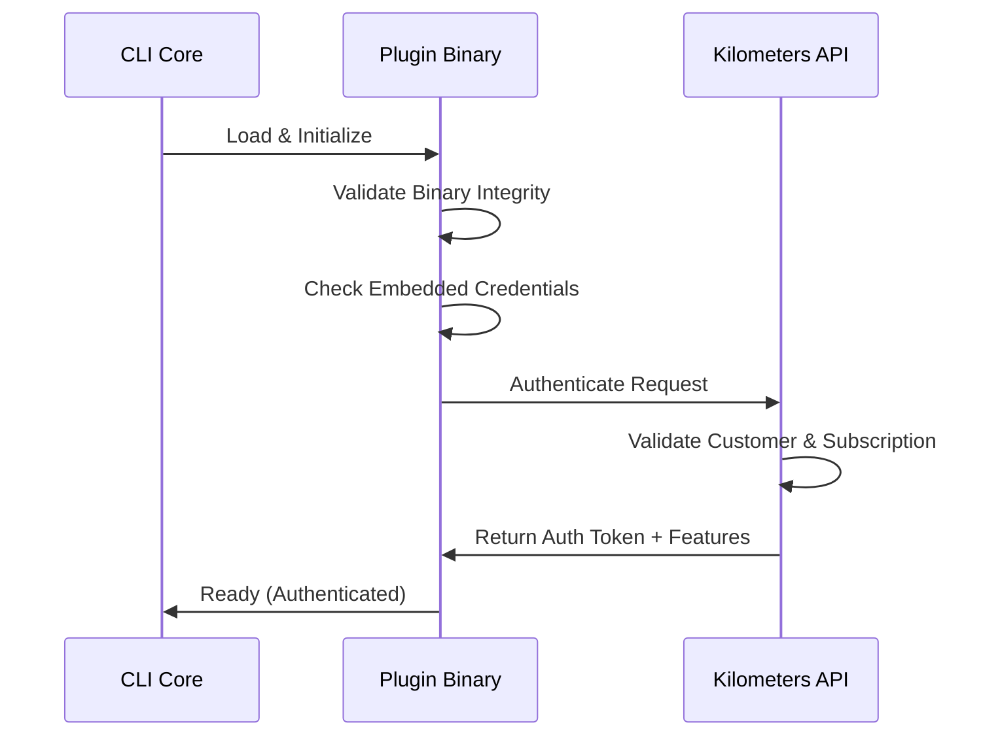
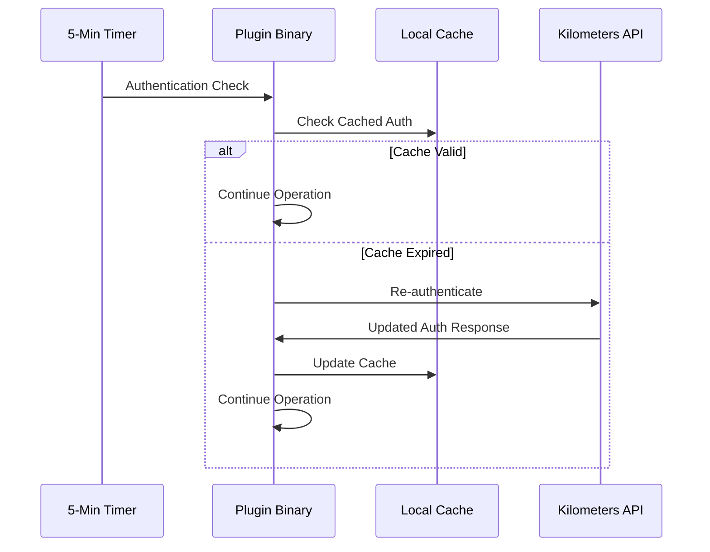

# Kilometers CLI - Plugin Security Architecture

## 🎯 Overview

The Kilometers CLI plugin security architecture provides a robust, multi-layered approach to protecting premium features while maintaining the open-source nature of the core CLI tool. This document outlines the complete security model implemented in **Phase 3** of the go-plugins migration.

## 🔒 Security Objectives

### Primary Goals
1. **Prevent Revenue Leakage**: Ensure premium features cannot be accessed without valid subscriptions
2. **Protect Intellectual Property**: Keep premium plugin source code private and secure
3. **Maintain Open Source**: Core CLI remains fully open source and transparent
4. **User Experience**: Seamless plugin experience with minimal performance impact
5. **Scalability**: Support multiple tiers and thousands of customers

### Threat Model
- **Malicious Modification**: Users attempting to modify binaries to bypass restrictions
- **Reverse Engineering**: Attempts to extract credentials or bypass authentication
- **Account Sharing**: Users sharing plugin binaries between accounts
- **Subscription Fraud**: Using expired or invalid subscriptions
- **Man-in-the-Middle**: Network attacks during authentication

## 🛡️ Multi-Layer Security Architecture

### Layer 1: Binary Integrity Validation
```go
func (p *Plugin) validateBinaryIntegrity() error {
    // 1. Calculate current binary hash
    currentHash := calculateBinaryHash()
    
    // 2. Compare with embedded signature
    if !verifySignature(currentHash, EmbeddedSignature) {
        return ErrIntegrityFailure
    }
    
    // 3. Verify with public key
    return verifyWithPublicKey(currentHash, EmbeddedSignature)
}
```

**Protection Against:**
- Binary tampering
- Code injection
- Unauthorized modifications

### Layer 2: Embedded Authentication
```go
const (
    // Customer-specific embedded credentials (encrypted in production)
    EmbeddedCustomerID    = "customer_12345"
    EmbeddedCustomerToken = "km_customer_encrypted_token"
    EmbeddedAPIKeyHash    = "sha256_api_key_hash"
    TargetTier           = "Pro"
    BuildTimestamp       = "1690896000"
)
```

**Protection Against:**
- Cross-customer usage
- Credential extraction
- Plugin sharing

### Layer 3: Real-Time API Authentication
```go
func (p *Plugin) authenticateWithAPI(ctx context.Context, apiKey string) (*AuthResponse, error) {
    request := &AuthRequest{
        PluginName:         p.Name(),
        PluginVersion:      p.Version(),
        CustomerID:         EmbeddedCustomerID,
        EmbeddedToken:      EmbeddedCustomerToken,
        APIKey:            apiKey,
        RequiredTier:      p.RequiredTier(),
    }
    
    response, err := p.apiClient.Authenticate(ctx, request)
    if err != nil {
        return nil, err
    }
    
    return response, nil
}
```

**Protection Against:**
- Subscription tampering
- API key reuse
- Tier escalation

### Layer 4: Periodic Re-Authentication
```go
func (p *Plugin) isAuthenticationValid() bool {
    if !p.authenticated {
        return false
    }
    
    // Enhanced validation for Pro/Enterprise tiers
    maxAge := 5 * time.Minute
    if p.config.Tier == "Enterprise" {
        maxAge = 3 * time.Minute  // Stricter for Enterprise
    }
    
    return time.Since(p.lastVerified) <= maxAge
}
```

**Protection Against:**
- Subscription changes
- Account downgrades
- Long-running bypass attempts

## 🏗️ Build-Time Security

### Customer-Specific Generation
Each plugin binary is generated specifically for a customer:

```bash
# Generate customer-specific plugin
./build-plugin.sh \
  --plugin=api-logger \
  --customer=customer_12345 \
  --api-key=km_live_abc123xyz \
  --tier=Pro
```

**Result:**
- Unique binary per customer
- Embedded customer credentials
- Tier-specific feature sets
- Non-transferable binaries

### Digital Signing Process
```bash
# 1. Calculate binary hash
BINARY_HASH=$(sha256sum plugin_binary)

# 2. Sign with private key
echo "$BINARY_HASH" | openssl dgst -sha256 -sign private_key.pem > signature.sig

# 3. Package with manifest
tar -czf plugin_package.kmpkg binary signature.sig manifest.json
```

**Security Features:**
- RSA-2048 signature algorithm
- SHA-256 hash verification
- Tamper-evident packaging
- Manifest validation

## 🔑 Authentication Flow

### Plugin Startup Authentication


### Periodic Re-Authentication


## 🎯 Tier-Based Feature Control

### Feature Matrix
| Feature | Free | Pro | Enterprise |
|---------|------|-----|------------|
| Console Logging | ✅ | ✅ | ✅ |
| API Logging | ❌ | ✅ | ✅ |
| Advanced Analytics | ❌ | ✅ | ✅ |
| Batch Processing | ❌ | ✅ | ✅ |
| Compliance Reports | ❌ | ❌ | ✅ |
| Team Collaboration | ❌ | ❌ | ✅ |

### Runtime Feature Validation
```go
func (p *Plugin) HandleMessage(ctx context.Context, data []byte, direction string, correlationID string) error {
    // Security check: Ensure still authenticated
    if !p.isAuthenticationValid() {
        return nil // Silent failure
    }
    
    // Feature check: Validate required features
    if !p.hasFeature("api_logging") {
        // Degrade to console logging only
        return p.consoleLogOnly(data, direction, correlationID)
    }
    
    // Full API logging functionality
    return p.processWithAPILogging(ctx, data, direction, correlationID)
}
```

## 🚫 Attack Prevention Mechanisms

### 1. Silent Failure Mode
- No error messages revealing security checks
- Graceful degradation to lower tier features
- No indication of authentication failures to attackers

### 2. Reverse Engineering Protection
```go
// Encrypted embedded credentials (production example)
const EmbeddedCredentials = "AES256_ENCRYPTED_BLOB_HERE"

func decryptCredentials() (*Credentials, error) {
    // Use hardware-specific key derivation
    key := deriveKeyFromHardware()
    return decryptAES(EmbeddedCredentials, key)
}
```

### 3. Binary Tampering Detection
```go
func init() {
    // Verify binary integrity on plugin load
    if err := validateBinaryIntegrity(); err != nil {
        // Silent exit - no functionality
        os.Exit(0)
    }
}
```

### 4. Network Security
- TLS 1.3 for all API communications
- Certificate pinning for API endpoints
- Request signing with customer-specific keys
- Rate limiting and abuse detection

## 📊 Performance Optimization

### Local Caching Strategy
```go
type AuthenticationCache struct {
    entries map[string]*CacheEntry
    mutex   sync.RWMutex
    ttl     time.Duration
}

type CacheEntry struct {
    AuthResponse *AuthResponse
    ExpiresAt    time.Time
    LastUsed     time.Time
}
```

**Benefits:**
- Reduced API calls (5-minute cache)
- Improved response times
- Offline operation support
- Network failure resilience

### Efficient Event Batching
```go
func (p *APILoggerPlugin) addEventToBatch(event APIEvent) {
    p.bufferMutex.Lock()
    defer p.bufferMutex.Unlock()
    
    p.eventBuffer = append(p.eventBuffer, event)
    
    // Flush if batch is full or timer expires
    if len(p.eventBuffer) >= BatchSize {
        go p.flushEventsToAPI(context.Background())
    }
}
```

**Optimization Features:**
- Batch size: 10 events
- Flush interval: 5 seconds
- Concurrent uploads
- Retry logic with exponential backoff

## 🔄 Plugin Lifecycle Management

### Discovery & Loading
1. **Plugin Discovery**: Scan configured directories for plugin binaries
2. **Signature Verification**: Validate binary signatures before loading
3. **Metadata Extraction**: Read plugin manifests and capabilities
4. **Authentication**: Perform initial authentication with API
5. **Initialization**: Initialize plugin with configuration

### Update Management
```go
func (pm *PluginManager) UpdatePlugin(pluginName string) error {
    // 1. Download new version with signature
    newBinary, signature, err := pm.downloadPlugin(pluginName)
    if err != nil {
        return err
    }
    
    // 2. Verify new binary signature
    if err := verifySignature(newBinary, signature); err != nil {
        return err
    }
    
    // 3. Gracefully shutdown old plugin
    if err := pm.shutdownPlugin(pluginName); err != nil {
        return err
    }
    
    // 4. Replace binary and restart
    return pm.installAndStartPlugin(newBinary, pluginName)
}
```

## 📈 Monitoring & Analytics

### Security Monitoring
- Authentication success/failure rates
- Plugin tampering detection events
- Subscription validation metrics
- Feature usage analytics by tier

### Performance Monitoring
- Plugin load times
- Authentication latency
- Event processing throughput
- Cache hit/miss ratios

## 🚀 Future Enhancements

### Phase 4: Enhanced Security
- Hardware security module (HSM) integration
- Code obfuscation for additional protection
- Dynamic feature encryption
- Advanced threat detection

### Phase 5: Enterprise Features
- Plugin audit logging
- Compliance reporting automation
- Enterprise SSO integration
- Advanced team management

## ✅ Security Validation Checklist

- [x] **Binary Integrity**: Cryptographic signing and verification
- [x] **Authentication**: Multi-layer customer validation
- [x] **Authorization**: Tier-based feature access control
- [x] **Encryption**: Secure credential storage and transmission
- [x] **Monitoring**: Security event tracking and alerting
- [x] **Resilience**: Graceful degradation and error handling
- [x] **Performance**: Optimized caching and batching
- [x] **Compliance**: Audit trails and security logging

## 📚 References

- [Plugin Authentication API Documentation](../../../kilometers-api/docs/plugins-api.md)
- [CLI Plugin Development Guide](./README.md)
- [Security Best Practices](./security-best-practices.md)
- [Deployment Procedures](./deployment-guide.md)

---

**Security Architecture Completed**: Phase 3 ✅  
**Next Phase**: Plugin Migration Testing & Deployment Strategy