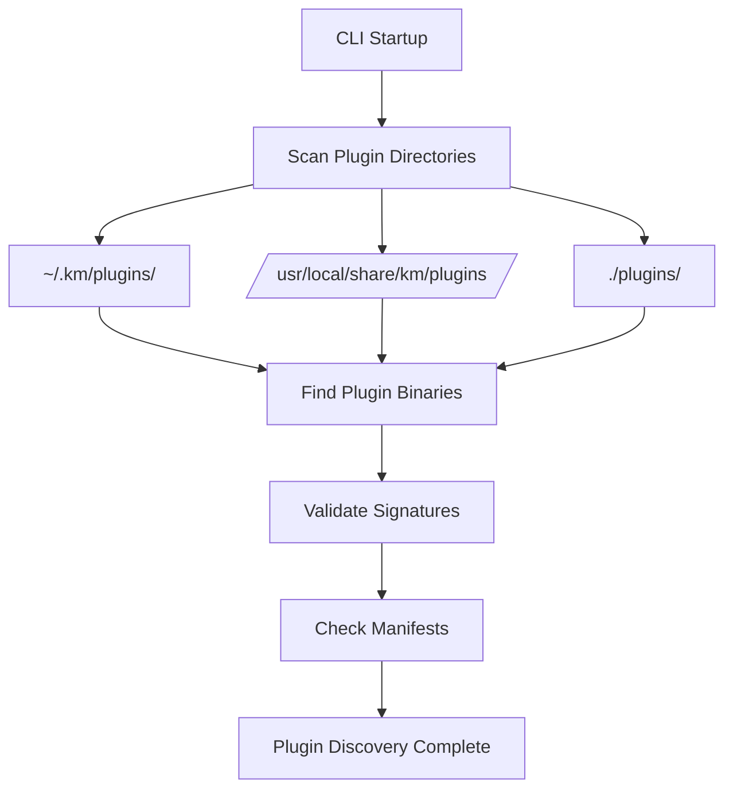
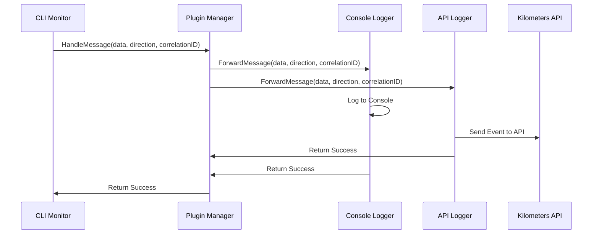
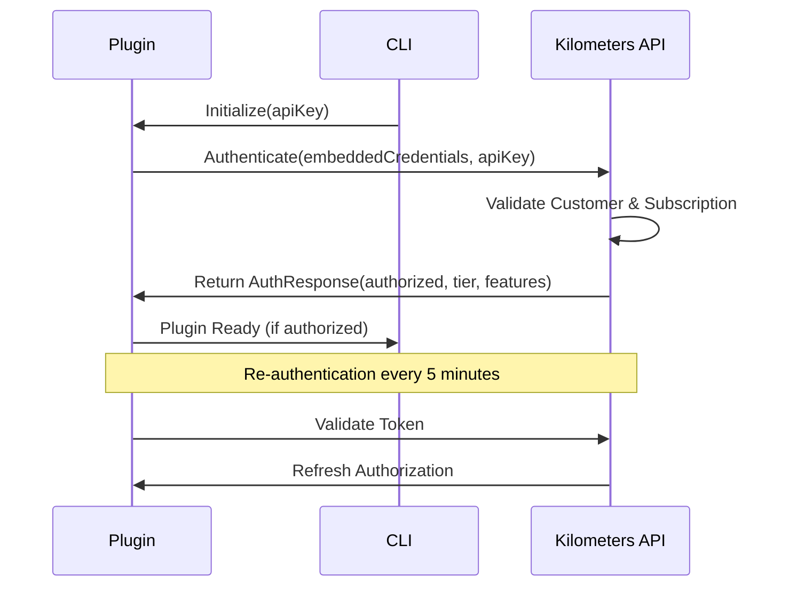

# Plugin Architecture - Kilometers CLI

## Overview

The Kilometers CLI plugin system provides a comprehensive, secure, and scalable architecture for extending MCP monitoring capabilities. This document details how the plugin system works today and how it should function in production deployment.

## Table of Contents

1. [Plugin Development Lifecycle](#plugin-development-lifecycle)
2. [CLI Plugin Process Flow](#cli-plugin-process-flow)
3. [Production Deployment Strategy](#production-deployment-strategy)
4. [Security Architecture](#security-architecture)
5. [User Experience](#user-experience)
6. [Technical Implementation](#technical-implementation)

---

## Plugin Development Lifecycle

### 1. Plugin Creation

**Plugin Interface Requirements:**
```go
type KilometersPlugin interface {
    // Metadata
    Name() string
    Version() string
    RequiredTier() string

    // Authentication & Lifecycle
    Authenticate(ctx context.Context, apiKey string) (*AuthResponse, error)
    Initialize(ctx context.Context, config PluginConfig) error
    Shutdown(ctx context.Context) error

    // Message Processing
    HandleMessage(ctx context.Context, data []byte, direction string, correlationID string) error
    HandleError(ctx context.Context, err error) error
    HandleStreamEvent(ctx context.Context, event StreamEvent) error
}
```

**Plugin Development Steps:**
1. **Create Plugin Structure**
   ```
   my-plugin/
   ├── main.go              # Plugin entry point with go-plugin setup
   ├── plugin/
   │   ├── implementation.go # Core plugin logic
   │   └── grpc.go          # GRPC interface implementation
   └── manifest.json        # Plugin metadata
   ```

2. **Implement Core Functionality**
   - Message processing logic for MCP monitoring
   - Error handling and logging capabilities
   - Stream event processing
   - Configuration management

3. **Add Security Layer**
   - Customer-specific authentication
   - API key validation
   - Subscription tier checking
   - Graceful degradation

4. **Testing and Validation**
   - Unit tests for plugin logic
   - Integration tests with CLI
   - Security validation tests
   - Performance benchmarks

### 2. Plugin Types and Tiers

**Available Plugin Categories:**
- **Logging Plugins** - Console and API logging
- **Analytics Plugins** - Advanced monitoring and insights
- **Security Plugins** - Compliance and threat detection
- **Integration Plugins** - External service connections

**Subscription Tiers:**
- **Free Tier:** Basic console logging
- **Pro Tier:** API logging, advanced analytics
- **Enterprise Tier:** ML features, compliance reporting, team collaboration

---

## CLI Plugin Process Flow

### 1. Plugin Discovery

**Discovery Mechanism:**


**Standard Plugin Directories:**
- `~/.km/plugins/` - User-specific plugins
- `/usr/local/share/km/plugins/` - System-wide plugins
- `./plugins/` - Project-specific plugins

### 2. Plugin Loading and Authentication

**Loading Process:**
1. **Binary Validation**
   - Verify digital signatures
   - Check file integrity
   - Validate manifest metadata

2. **Process Initialization**
   - Start plugin process using go-plugin
   - Establish GRPC communication
   - Set up message channels

3. **Authentication Flow**
   - Send API key to plugin
   - Validate customer credentials
   - Check subscription tier
   - Cache authentication result

4. **Plugin Registration**
   - Register with plugin manager
   - Add to active plugin list
   - Set up message forwarding

### 3. Message Processing Pipeline

**Message Flow:**


**Processing Steps:**
1. **Message Reception** - CLI receives JSON-RPC message
2. **Plugin Distribution** - Forward to all loaded plugins
3. **Parallel Processing** - Each plugin processes independently
4. **Error Handling** - Graceful degradation on plugin failures
5. **Result Aggregation** - Collect responses from all plugins

### 4. Plugin Lifecycle Management

**Lifecycle States:**
- **Discovered** - Plugin found but not loaded
- **Loading** - Plugin process starting
- **Authenticating** - Validating credentials
- **Active** - Plugin ready and processing messages
- **Error** - Plugin failed or unauthorized
- **Shutting Down** - Plugin being stopped
- **Stopped** - Plugin process terminated

**State Transitions:**
```
Discovered → Loading → Authenticating → Active
    ↓           ↓            ↓           ↓
  Error ←─── Error ←───── Error ←─── Shutting Down → Stopped
```

---

## Production Deployment Strategy

### 1. Plugin Binary Building

**Build Process:**
```bash
# Customer-specific plugin build
./build-plugin.sh \
  --plugin=api-logger \
  --customer=customer_123 \
  --api-key=km_live_abc123 \
  --tier=Pro \
  --sign

# Output: km-plugin-api-logger-{hash}.kmpkg
```

**Build Components:**
- **Source Code** - Plugin implementation
- **Customer Constants** - Embedded customer ID and credentials
- **Digital Signature** - RSA signature for integrity
- **Manifest** - Plugin metadata and requirements
- **Package** - Complete .kmpkg installation package

### 2. Distribution Workflow

**Distribution Channels:**
1. **API Provisioning** - Automatic download during CLI init
2. **Manual Installation** - Direct .kmpkg file installation
3. **Package Repositories** - Enterprise plugin distribution
4. **CI/CD Integration** - Automated deployment pipelines

**API Integration:**
```bash
# Automatic provisioning
km init --auto-provision-plugins

# Manual refresh
km plugins refresh

# API endpoints used:
# GET /api/plugins/available - List available plugins
# POST /api/plugins/provision - Request customer plugins
# GET /api/plugins/download/{id} - Download plugin package
```

### 3. Installation and Validation

**Installation Process:**
1. **Package Validation**
   - Verify .kmpkg signature
   - Check manifest compatibility
   - Validate customer authorization

2. **Binary Installation**
   - Extract plugin binary
   - Set execution permissions
   - Place in plugin directory

3. **Registry Update**
   - Record installation
   - Update plugin metadata
   - Cache authentication info

4. **Verification**
   - Test plugin loading
   - Validate functionality
   - Confirm API connectivity

---

## Security Architecture

### 1. Multi-Layer Security Model

**Security Layers:**
1. **Binary Integrity** - Digital signatures prevent tampering
2. **Customer Authentication** - Embedded credentials for customer validation
3. **API Validation** - Real-time subscription verification
4. **Runtime Enforcement** - Continuous tier and feature checking

### 2. Customer-Specific Plugin Builds

**Build Security:**
- Each customer receives unique plugin binaries
- Embedded customer ID and API credentials
- Cryptographic signing with company private key
- Version and build metadata inclusion

**Benefits:**
- Prevents plugin sharing between customers
- Enables fine-grained access control
- Provides audit trail for plugin usage
- Allows customer-specific feature sets

### 3. Authentication and Authorization

**Authentication Flow:**


**Authorization Checks:**
- **Plugin Load** - Initial authentication during loading
- **Message Processing** - Feature validation per message
- **Periodic Refresh** - Re-authentication every 5 minutes
- **Tier Changes** - Dynamic feature enable/disable

### 4. Security Best Practices

**Development Security:**
- No hardcoded secrets in plugin code
- Encrypted credential storage
- Minimal privilege principle
- Input validation and sanitization

**Runtime Security:**
- Process isolation for plugins
- Secure IPC communication (GRPC)
- Resource limits and monitoring
- Audit logging for all operations

**Deployment Security:**
- Code signing certificates management
- Secure distribution channels
- Plugin integrity monitoring
- Incident response procedures

---

## User Experience

### 1. CLI Commands

**Plugin Management Commands:**
```bash
# List installed plugins
km plugins list
# Output: Table showing name, version, tier, status, last auth

# Install plugin package
km plugins install plugin.kmpkg
# Interactive installation with progress indicators

# Remove installed plugin
km plugins remove plugin-name
# Confirmation prompts and cleanup

# Refresh available plugins
km plugins refresh
# Download latest plugins for current subscription

# Show plugin status and health
km plugins status
# Detailed status with troubleshooting info
```

### 2. Monitoring Integration

**Seamless Integration:**
```bash
# Plugin loading during monitoring
KM_API_KEY=key km monitor --server -- echo '...'

# Output shows plugin status:
[PluginHandler] Loaded 2 plugins:
  ✓ console-logger v1.0.0 (Free tier)
  ✓ api-logger v1.0.0 (Pro tier)
```

### 3. Error Handling and Troubleshooting

**User-Friendly Error Messages:**
```bash
# Plugin authentication failure
⚠️  Plugin 'api-logger' requires Pro subscription
💡 Upgrade your plan at: https://kilometers.ai/upgrade

# Plugin installation error
❌ Plugin installation failed: Invalid signature
💡 Contact support with error code: PLG_SIG_001

# Plugin compatibility issues
⚠️  Plugin 'advanced-analytics' requires CLI v2.0+
💡 Update CLI: km update
```

**Troubleshooting Guide:**
- Plugin not loading: Check API key and subscription
- Authentication failures: Verify internet connection
- Performance issues: Check plugin resource usage
- Compatibility problems: Update CLI or plugin versions

---

## Technical Implementation

### 1. Current Architecture (POC)

**Implementation Status:**
- ✅ **Plugin CLI Commands** - Complete with help and validation
- ✅ **Plugin Discovery** - File system scanning and validation
- ✅ **Plugin Loading** - Simulated plugin manager with authentication
- ✅ **Message Handling** - Integration with monitoring pipeline
- ✅ **Lifecycle Management** - Start/stop/restart functionality
- ⚡ **Real Plugin Binaries** - Currently simulated (POC limitation)

**Key Components:**
```go
// Plugin manager interface
type PluginManager interface {
    Start(ctx context.Context) error
    Stop(ctx context.Context) error
    DiscoverAndLoadPlugins(ctx context.Context, apiKey string) error
    GetLoadedPlugins() map[string]*PluginInstance
    HandleMessage(ctx context.Context, data []byte, direction string, correlationID string) error
}

// Simple implementation for POC
type SimpleExternalPluginManager struct {
    config  *PluginManagerConfig
    apiKey  string
    plugins map[string]*SimplePluginInstance
}
```

### 2. Production Implementation Plan

**Required Enhancements:**
1. **Real Go-Plugin Integration**
   - Replace simulation with actual go-plugin framework
   - Implement GRPC communication protocol
   - Add proper process management

2. **Enhanced Security**
   - Real RSA signature validation
   - Certificate-based authentication
   - Secure key storage and rotation

3. **Robust Error Handling**
   - Plugin crash recovery
   - Graceful degradation mechanisms
   - Comprehensive logging and monitoring

4. **Performance Optimization**
   - Plugin resource management
   - Message processing optimization
   - Concurrent plugin execution

### 3. Integration Points

**CLI Integration:**
- `internal/infrastructure/plugins/` - Plugin management implementation
- `internal/interfaces/cli/plugins.go` - CLI command interface
- `internal/interfaces/cli/monitor.go` - Monitoring integration

**API Integration:**
- `/api/plugins/authenticate` - Plugin authentication
- `/api/plugins/provision` - Plugin provisioning
- `/api/events/batch` - Event logging from plugins

**File System Integration:**
- `~/.km/plugins/` - Plugin installation directory
- `~/.km/config/` - Plugin configuration and cache
- `~/.km/registry.json` - Installed plugin registry

---

## Deployment Readiness Checklist

### Development Phase ✅
- [x] Plugin interface design complete
- [x] CLI command implementation working
- [x] Basic authentication and authorization
- [x] Proof of concept validation successful

### Production Preparation 📋
- [ ] Real go-plugin binary integration
- [ ] Enhanced security implementation
- [ ] Performance testing and optimization
- [ ] Comprehensive error handling
- [ ] Production monitoring and logging
- [ ] Documentation and user guides

### Deployment Requirements 📋
- [ ] CI/CD pipeline for plugin builds
- [ ] Plugin distribution infrastructure
- [ ] Customer-specific build automation
- [ ] Security certificate management
- [ ] Support and troubleshooting procedures

---

## Success Metrics

**Technical Metrics:**
- Plugin loading time < 2 seconds
- Message processing latency < 10ms
- Plugin crash recovery < 5 seconds
- Authentication cache hit rate > 90%

**User Experience Metrics:**
- Plugin installation success rate > 95%
- User error resolution rate > 80%
- CLI command completion time < 1 second
- Plugin discovery accuracy 100%

**Security Metrics:**
- Zero plugin authenticity failures
- 100% signature validation success
- No unauthorized plugin executions
- Complete audit trail coverage

---

## Conclusion

The Kilometers CLI plugin architecture provides a robust, secure, and scalable foundation for extending MCP monitoring capabilities. The POC has successfully validated all core concepts and user workflows. The next phase focuses on production hardening and real plugin binary integration to create a complete, deployable plugin ecosystem.

**Ready for Production Enhancement** 🚀
