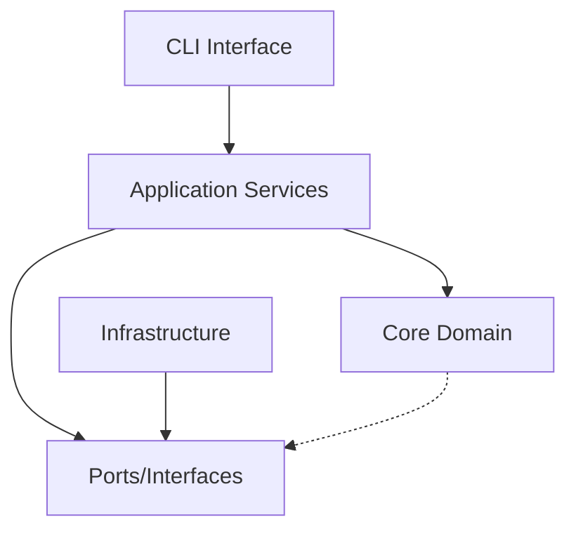
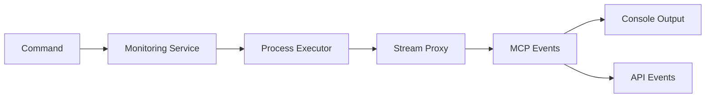

# System Patterns - Kilometers CLI

## Architecture Overview

### Domain-Driven Design (DDD) Structure
The project follows DDD principles with clear bounded contexts and separation of concerns:

```
internal/
├── core/           # Domain Layer (Business Logic)
├── application/    # Application Layer (Use Cases)
├── infrastructure/ # Infrastructure Layer (External Concerns)
└── interfaces/     # Interface Adapters (CLI, API)
```

### Clean Architecture Layering
Dependencies flow inward toward the core domain:



## Core Domain Models

### 1. JSON-RPC Message (Entity)
```go
type JSONRPCMessage struct {
    ID            MessageID
    Type          MessageType // Request, Response, Notification
    Method        string
    Payload       json.RawMessage
    Timestamp     time.Time
    Direction     Direction   // Inbound, Outbound
    CorrelationID string      // For event correlation
}
```

**Responsibilities**:
- Represent individual RPC messages
- Parse JSON-RPC format
- Extract metadata
- Validate message structure
- Provide correlation for event tracking

### 2. Server Command (Value Object)
```go
type Command struct {
    Executable string
    Args       []string
    WorkingDir string
    Env        map[string]string
}
```

**Responsibilities**:
- Encapsulate server execution details
- Validate command structure
- Provide execution context

### 3. Monitor Configuration (Value Object)
```go
type MonitorConfig struct {
    BufferSize int
}
```

**Responsibilities**:
- Configure monitoring behavior
- Set buffer sizes for message processing
- Define monitoring parameters

## Event-Driven Architecture

### Core Principle
The system operates as a **stateless, event-driven architecture**:
- **No persistent state** - events are processed and forwarded immediately
- **Correlation-based tracking** - use correlation IDs instead of session state
- **Real-time processing** - messages flow directly from capture to output
- **Event streams** - all communication becomes events

### Event Flow


## Hexagonal Architecture Ports

### Inbound Ports (Use Cases)
```go
// Monitoring service interface
type MonitoringService interface {
    StartMonitoring(ctx context.Context, cmd Command, correlationID string, config MonitorConfig) error
}
```

### Outbound Ports (Infrastructure Dependencies)
```go
// Process execution
type ProcessExecutor interface {
    Execute(ctx context.Context, cmd Command) (Process, error)
}

// Message handling
type MessageHandler interface {
    HandleMessage(ctx context.Context, data []byte, direction Direction) error
    HandleError(ctx context.Context, err error)
    HandleStreamEvent(ctx context.Context, event StreamEvent)
}
```

## Infrastructure Adapters

### 1. Process Management
**Pattern**: Adapter + Observer
```go
type ProcessAdapter struct {
    executor exec.Cmd
    streams  StreamManager
    monitors []ProcessMonitor
}
```

**Responsibilities**:
- Execute server commands
- Manage stdin/stdout/stderr streams
- Monitor process health
- Handle graceful shutdown

### 2. Stream Proxying
**Pattern**: Pipe and Filter
```go
type StreamProxy struct {
    process       Process
    correlationID string
    config        MonitorConfig
    messageLogger MessageHandler
}
```

**Responsibilities**:
- Proxy data between client and server
- Extract JSON-RPC messages from streams
- Emit events for captured messages
- Maintain message ordering

### 3. Event Handling
**Pattern**: Decorator + Chain of Responsibility
```go
type ApiHandler struct {
    baseHandler   MessageHandler
    apiClient     *ApiClient
    correlationID string
}
```

**Responsibilities**:
- Process messages through base handler
- Send events to external API
- Correlate events using correlation ID
- Handle API communication errors

## Key Design Patterns

### 1. Event Sourcing (Simplified)
All monitoring activity becomes events:
```go
// Events are emitted immediately without storage
type McpEventDto struct {
    Id        string
    Timestamp string
    Direction string
    Method    string
    Payload   string
    Size      int
    SessionId string // Contains correlation ID for event tracking
}
```

### 2. Command Pattern
Encapsulates CLI operations:
```go
type MonitorCommand struct {
    cmd           Command
    correlationID string
    config        MonitorConfig
}

func (c *MonitorCommand) Execute(ctx context.Context) error {
    // Start event-driven monitoring
}
```

### 3. Decorator Pattern
Enhances message handling:
```go
type MessageHandlerDecorator interface {
    HandleMessage(ctx context.Context, data []byte, direction Direction) error
}

// Console handler for local output
type ConsoleHandler struct{}

// API handler decorates console handler with remote events
type ApiHandler struct {
    baseHandler MessageHandlerDecorator
}
```

### 4. Factory Pattern
Creates configured components:
```go
type MonitoringServiceFactory struct {
    processExecutor ProcessExecutor
    messageLogger   MessageHandler
}
```

## Error Handling Strategy

### 1. Domain Errors
```go
type DomainError struct {
    Code    ErrorCode
    Message string
    Context map[string]interface{}
}
```

### 2. Error Categories
- **ValidationError**: Invalid input or configuration
- **ProcessError**: Server command execution failures  
- **CommunicationError**: Stream or message parsing issues
- **SystemError**: Infrastructure or resource failures

### 3. Graceful Degradation
- Monitor failures don't stop server execution
- Partial message capture is acceptable
- Logging errors are reported but non-fatal
- API failures don't impact local monitoring

## Concurrency Patterns

### 1. Event Processing Pipeline
Handle multiple concurrent streams:
```go
type EventPipeline struct {
    input    chan []byte
    output   chan Event
    handlers []EventHandler
}
```

### 2. Channel-based Communication
Coordinate between goroutines:
```go
type MonitoringCoordinator struct {
    events   chan MCP Event
    errors   chan error
    shutdown chan struct{}
}
```

### 3. Context Propagation
Handle cancellation and timeouts:
```go
func (s *MonitoringService) StartMonitoring(ctx context.Context, cmd Command, correlationID string, config MonitorConfig) error {
    ctx, cancel := context.WithCancel(ctx)
    defer cancel()
    // Implementation with context propagation
}
```

## Testing Strategies

### 1. Unit Testing
- Domain models with property-based testing
- Service interfaces with mocked dependencies
- Value objects with comprehensive scenarios

### 2. Integration Testing
- Real process execution with mock servers
- Stream processing with sample data
- End-to-end CLI command testing

### 3. Event Testing
- Message parsing and event generation
- API event correlation and delivery
- Error handling and recovery scenarios 