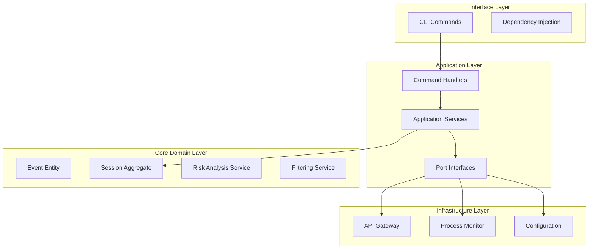

# System Patterns: Architecture and Design

## Architecture Overview

Kilometers CLI follows **Domain-Driven Design (DDD)** and **Hexagonal Architecture** principles, providing clear separation of concerns and high testability.



## Domain-Driven Design Implementation

### Bounded Context: MCP Monitoring
The entire application operates within a single bounded context focused on MCP event monitoring and analysis.

#### Ubiquitous Language
- **Event**: A single MCP JSON-RPC message with metadata
- **Session**: A monitoring session grouping related events
- **Batch**: A collection of events ready for transmission
- **Risk Score**: Quantified security/operational risk assessment
- **Filter**: Rules determining which events to capture
- **Monitor**: Process wrapper that captures MCP communication

### Domain Entities and Value Objects

#### Event (Entity)
```go
type Event struct {
    id        EventID        // Value Object
    timestamp time.Time
    direction Direction      // Value Object  
    method    Method         // Value Object
    payload   []byte
    riskScore RiskScore      // Value Object
}
```

**Key Behaviors**:
- Immutable after creation (except risk score updates)
- Self-validating during construction
- Rich methods for querying risk level

#### Session (Aggregate Root)
```go
type Session struct {
    id     SessionID       // Value Object
    state  SessionState    // Value Object
    config SessionConfig   // Value Object
    events []*Event
    batches []*EventBatch
}
```

**Key Behaviors**:
- Manages event lifecycle within session
- Enforces batching rules and size limits
- Controls session state transitions
- Provides consistent event ordering

#### Value Objects
- **EventID**: Unique identifier for events
- **SessionID**: Unique identifier for sessions  
- **Method**: MCP method name with validation
- **Direction**: Inbound/Outbound message direction
- **RiskScore**: 0-100 risk assessment with level categorization

### Domain Services

#### Risk Analysis Service
```go
type RiskAnalyzer interface {
    AnalyzeEvent(event *Event) (RiskScore, error)
}
```

**Responsibilities**:
- Pattern-based risk detection
- Method-specific risk scoring
- Payload content analysis
- Configurable risk thresholds

#### Filtering Service  
```go
type EventFilter interface {
    ShouldCapture(event *Event) bool
    GetFilterReason(event *Event) string
}
```

**Responsibilities**:
- Method whitelist/blacklist filtering
- Size-based filtering
- Risk-based filtering
- Content pattern filtering

## Hexagonal Architecture Implementation

### Ports (Interfaces)
All external dependencies are defined as ports in the application layer:

```go
// Primary Ports (inbound)
type MonitoringService interface {
    StartMonitoring(cmd *StartMonitoringCommand) (*MonitoringResult, error)
    StopMonitoring(cmd *StopMonitoringCommand) (*MonitoringResult, error)
}

// Secondary Ports (outbound)
type APIGateway interface {
    SendEventBatch(batch *EventBatch) error
    TestConnection() error
}

type ProcessMonitor interface {
    Start(command string, args []string) error
    Stop() error
    ReadStdout() <-chan []byte
    WriteStdin(data []byte) error
}

type SessionRepository interface {
    Save(session *Session) error
    FindByID(id SessionID) (*Session, error)
    FindActive() (*Session, error)
}
```

### Adapters (Infrastructure)

#### API Gateway Adapter
- **Purpose**: Communicates with Kilometers platform
- **Patterns**: Circuit breaker, retry logic, authentication
- **Technologies**: HTTP client with JSON serialization

#### Process Monitor Adapter  
- **Purpose**: Wraps and monitors MCP server processes
- **Patterns**: Observer pattern for stdout/stderr streams
- **Technologies**: os/exec package with streaming I/O

#### Configuration Adapter
- **Purpose**: Multi-source configuration management
- **Patterns**: Composite pattern for config sources
- **Technologies**: JSON files, environment variables, CLI flags

## Key Design Patterns

### 1. Command Pattern (Application Layer)
```go
type Command interface {
    Validate() error
}

type CommandHandler[T Command, R any] interface {
    Handle(cmd T) (R, error)
}
```

**Benefits**: 
- Clear separation of input validation and business logic
- Easy testing and mocking
- Consistent error handling

### 2. Repository Pattern (Persistence)
```go
type SessionRepository interface {
    Save(session *Session) error
    FindByID(id SessionID) (*Session, error)
    FindActive() (*Session, error)
}
```

**Benefits**:
- Decoupled persistence logic
- Easy swapping of storage implementations
- Clear domain model persistence contracts

### 3. Strategy Pattern (Filtering & Risk Analysis)
```go
type EventFilter interface {
    ShouldCapture(event *Event) bool
}

type CompositeFilter struct {
    methodFilter  EventFilter
    sizeFilter    EventFilter  
    riskFilter    EventFilter
    contentFilter EventFilter
}
```

**Benefits**:
- Pluggable filtering strategies
- Composite filtering with multiple rules
- Easy addition of new filter types

### 4. Factory Pattern (Domain Object Creation)
```go
func CreateEvent(direction Direction, method Method, payload []byte, riskScore RiskScore) (*Event, error)
func NewSession(config SessionConfig) (*Session, error)
```

**Benefits**:
- Controlled object construction
- Validation during creation
- Consistent initialization

## Architecture Decisions

### 1. Single Bounded Context
**Decision**: Use one bounded context for the entire application  
**Rationale**: Application scope is focused on MCP monitoring; additional contexts would add unnecessary complexity  
**Trade-offs**: May need refactoring if scope expands significantly

### 2. In-Memory Event Storage
**Decision**: Use in-memory storage for events and sessions  
**Rationale**: Events are transient and sent to platform; local persistence not required  
**Trade-offs**: Data lost on restart, but acceptable for monitoring use case

### 3. Synchronous Event Processing
**Decision**: Process events synchronously within batches  
**Rationale**: Maintains event ordering and simplifies error handling  
**Trade-offs**: Potential throughput limitations for very high-volume scenarios

### 4. JSON-RPC Protocol Focus
**Decision**: Optimize specifically for JSON-RPC 2.0 MCP messages  
**Rationale**: MCP is standardized on JSON-RPC; generic message handling would be inefficient  
**Trade-offs**: Coupled to MCP protocol evolution

## Code Organization

### Package Structure
```
internal/
├── core/                    # Domain Layer
│   ├── event/              # Event domain model
│   ├── session/            # Session aggregate  
│   ├── risk/               # Risk analysis domain service
│   └── filtering/          # Filtering domain service
├── application/            # Application Layer
│   ├── commands/           # Command DTOs
│   ├── services/           # Application services
│   └── ports/              # Interface definitions
├── infrastructure/        # Infrastructure Layer
│   ├── api/               # API gateway adapter
│   ├── monitoring/        # Process monitor adapter
│   └── config/            # Configuration adapter
└── interfaces/            # Interface Layer
    ├── cli/               # CLI command handlers
    └── di/                # Dependency injection
```

### Testing Strategy
- **Unit Tests**: Isolated testing of domain logic and value objects
- **Integration Tests**: End-to-end scenarios with mock MCP servers
- **Property-Based Tests**: Rapid testing for complex domain behaviors
- **Architecture Tests**: Validate dependency direction and layer boundaries

This architecture provides the foundation for a maintainable, testable, and extensible MCP monitoring solution while maintaining clear separation of concerns and domain focus. 