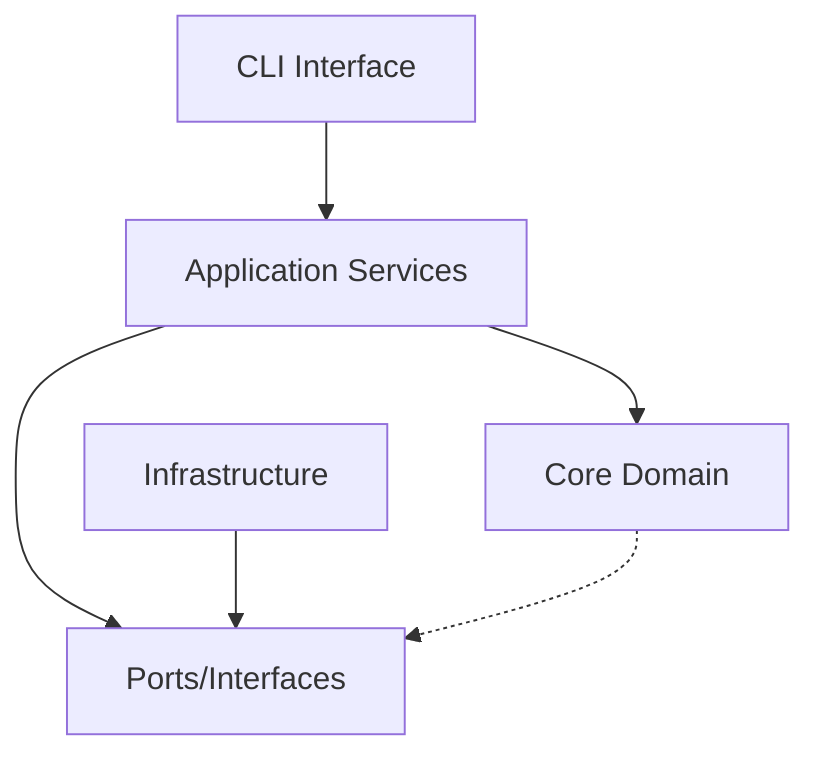

# System Patterns - Kilometers CLI

## Architecture Overview

### Domain-Driven Design (DDD) Structure
The project follows DDD principles with clear bounded contexts and separation of concerns:

```
internal/
├── core/           # Domain Layer (Business Logic)
├── application/    # Application Layer (Use Cases)
├── infrastructure/ # Infrastructure Layer (External Concerns)
└── interfaces/     # Interface Adapters (CLI, API)
```

### Clean Architecture Layering
Dependencies flow inward toward the core domain:



## Core Domain Models

### 1. Monitoring Session (Aggregate Root)
```go
type MonitoringSession struct {
    ID            SessionID
    ServerCommand Command
    StartTime     time.Time
    Status        SessionStatus
    messages      []JSONRPCMessage
    config        MonitorConfig
}
```

**Responsibilities**:
- Manage session lifecycle
- Coordinate message capture
- Enforce business rules
- Maintain session state

### 2. JSON-RPC Message (Entity)
```go
type JSONRPCMessage struct {
    ID        MessageID
    Type      MessageType // Request, Response, Notification
    Method    string
    Payload   json.RawMessage
    Timestamp time.Time
    Direction Direction   // Inbound, Outbound
}
```

**Responsibilities**:
- Represent individual RPC messages
- Parse JSON-RPC format
- Extract metadata
- Validate message structure

### 3. Server Command (Value Object)
```go
type Command struct {
    Executable string
    Args       []string
    WorkingDir string
    Env        map[string]string
}
```

**Responsibilities**:
- Encapsulate server execution details
- Validate command structure
- Provide execution context

## Hexagonal Architecture Ports

### Inbound Ports (Use Cases)
```go
// Monitoring service interface
type MonitoringService interface {
    StartMonitoring(ctx context.Context, cmd Command, config MonitorConfig) (*MonitoringSession, error)
    StopMonitoring(ctx context.Context, sessionID SessionID) error
    GetSessionStatus(ctx context.Context, sessionID SessionID) (SessionStatus, error)
}

// Replay service interface  
type ReplayService interface {
    SaveSession(ctx context.Context, session *MonitoringSession) error
    LoadSession(ctx context.Context, sessionID SessionID) (*MonitoringSession, error)
    ReplaySession(ctx context.Context, sessionID SessionID) error
}
```

### Outbound Ports (Infrastructure Dependencies)
```go
// Process execution
type ProcessExecutor interface {
    Execute(ctx context.Context, cmd Command) (Process, error)
}

// Message logging
type MessageLogger interface {
    LogMessage(ctx context.Context, msg JSONRPCMessage) error
    LogError(ctx context.Context, err error) error
}

// Session persistence
type SessionRepository interface {
    Save(ctx context.Context, session *MonitoringSession) error
    Load(ctx context.Context, sessionID SessionID) (*MonitoringSession, error)
}
```

## Infrastructure Adapters

### 1. Process Management
**Pattern**: Adapter + Observer
```go
type ProcessAdapter struct {
    executor exec.Cmd
    streams  StreamManager
    monitors []ProcessMonitor
}
```

**Responsibilities**:
- Execute server commands
- Manage stdin/stdout/stderr streams
- Monitor process health
- Handle graceful shutdown

### 2. Stream Proxying
**Pattern**: Pipe and Filter
```go
type StreamProxy struct {
    input    io.Reader
    output   io.Writer
    filters  []MessageFilter
    logger   MessageLogger
}
```

**Responsibilities**:
- Proxy data between client and server
- Extract JSON-RPC messages from streams
- Apply filtering and transformation
- Maintain message ordering

### 3. JSON-RPC Parser
**Pattern**: Chain of Responsibility
```go
type MessageParser struct {
    framers []MessageFramer
    parsers []JSONRPCParser
    validators []MessageValidator
}
```

**Responsibilities**:
- Handle message framing (line-based, length-prefixed)
- Parse JSON-RPC format
- Validate message structure
- Extract metadata

## Key Design Patterns

### 1. Repository Pattern
Abstracts session persistence:
```go
type SessionRepository interface {
    Save(ctx context.Context, session *MonitoringSession) error
    FindByID(ctx context.Context, id SessionID) (*MonitoringSession, error)
    FindActive(ctx context.Context) ([]*MonitoringSession, error)
}
```

### 2. Command Pattern
Encapsulates CLI operations:
```go
type MonitorCommand struct {
    service MonitoringService
    config  MonitorConfig
}

func (c *MonitorCommand) Execute(ctx context.Context) error {
    // Command execution logic
}
```

### 3. Observer Pattern
Notifies about monitoring events:
```go
type MonitoringEventHandler interface {
    OnMessageReceived(msg JSONRPCMessage)
    OnError(err error)
    OnSessionComplete(session *MonitoringSession)
}
```

### 4. Factory Pattern
Creates configured components:
```go
type MonitoringServiceFactory struct {
    processExecutor ProcessExecutor
    messageLogger   MessageLogger
    sessionRepo     SessionRepository
}
```

## Error Handling Strategy

### 1. Domain Errors
```go
type DomainError struct {
    Code    ErrorCode
    Message string
    Context map[string]interface{}
}
```

### 2. Error Categories
- **ValidationError**: Invalid input or configuration
- **ProcessError**: Server command execution failures  
- **CommunicationError**: Stream or message parsing issues
- **SystemError**: Infrastructure or resource failures

### 3. Graceful Degradation
- Monitor failures don't stop server execution
- Partial message capture is acceptable
- Logging errors are reported but non-fatal

## Concurrency Patterns

### 1. Worker Pool
Handle multiple concurrent streams:
```go
type StreamWorkerPool struct {
    workers chan StreamWorker
    jobs    chan StreamJob
}
```

### 2. Channel-based Communication
Coordinate between goroutines:
```go
type MonitoringCoordinator struct {
    messages chan JSONRPCMessage
    errors   chan error
    shutdown chan struct{}
}
```

### 3. Context Propagation
Handle cancellation and timeouts:
```go
func (s *MonitoringService) StartMonitoring(ctx context.Context, cmd Command) error {
    ctx, cancel := context.WithCancel(ctx)
    defer cancel()
    // Implementation with context propagation
}
```

## Testing Strategies

### 1. Unit Testing
- Domain models with property-based testing
- Service interfaces with mocked dependencies
- Value objects with comprehensive scenarios

### 2. Integration Testing
- Real process execution with mock servers
- Stream processing with sample data
- End-to-end CLI command testing

### 3. Contract Testing
- JSON-RPC message format validation
- MCP specification compliance
- Cross-platform behavior verification 